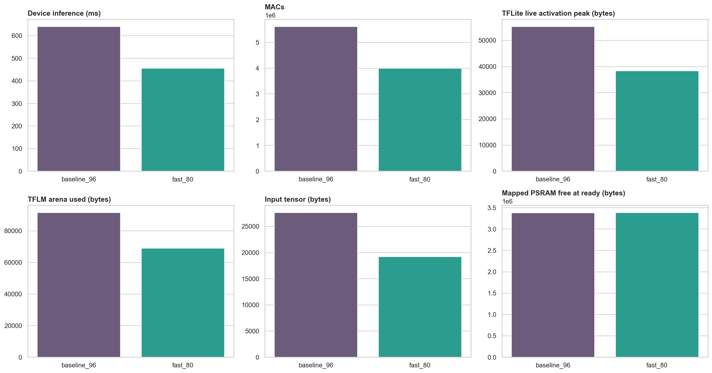
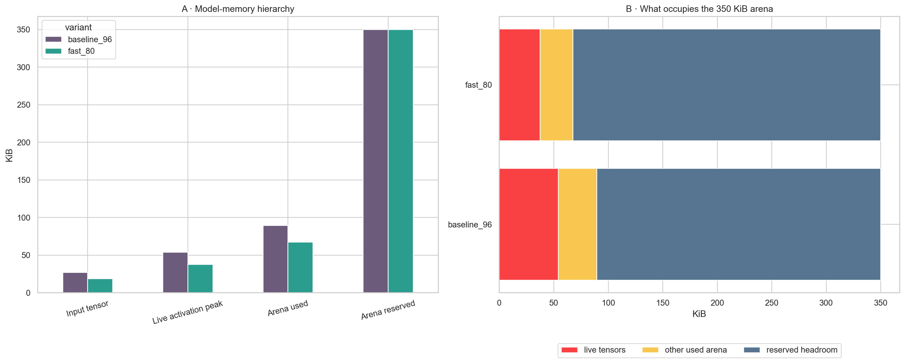
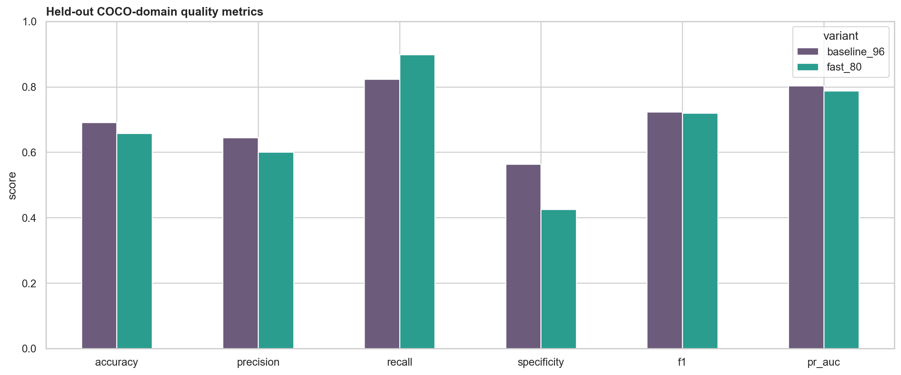
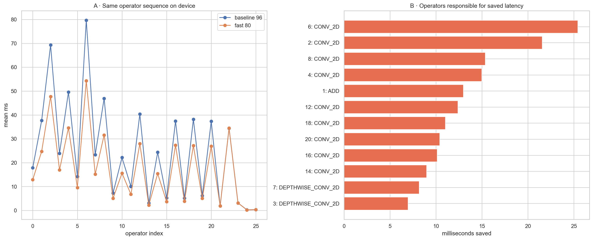
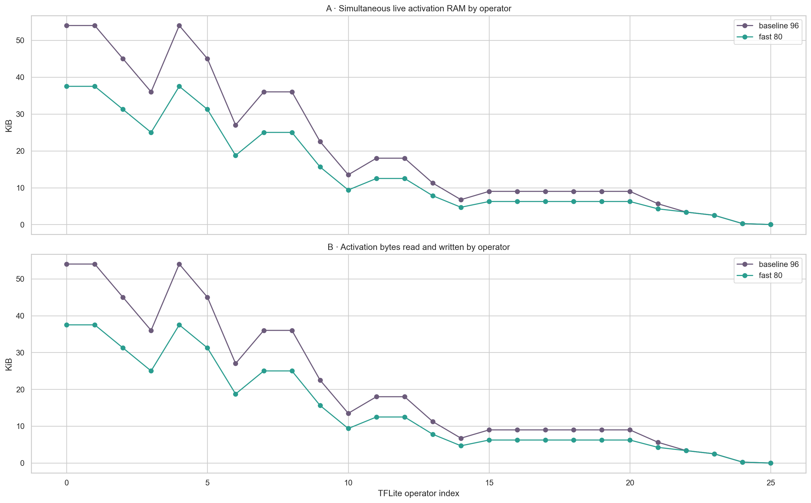

# Visual Wake Words for ESP32-CAM

Notebook-first pipeline for training a **person / no-person** Visual Wake Word model on real MS COCO 2017 images and exporting it as a full-INT8 TensorFlow Lite Micro model for an AI-Thinker ESP32-CAM.

> The 80x80 optimized model has been trained, exported, compiled, flashed, and smoke-tested on the connected board.

## Current deployed result (80x80)

| Item | Result |
|---|---:|
| Dataset | 12,000 train / 2,000 validation / 2,000 held-out test images |
| Model | Tiny MobileNetV1, width multiplier 0.25 |
| Input | 80 × 80 × 3 RGB, INT8 |
| Parameters | 111,793 |
| Compute | 3.994M MACs/image (29% below the 96x96 baseline) |
| Peak live INT8 activation estimate | 50 KiB (31% below the 96x96 baseline) |
| Fine-tuning | 8 epochs; validation PR-AUC 0.7831 |
| Offline COCO threshold | 0.27, selected on validation data |
| Device threshold | 0.44 after fixed-point camera preprocessing |
| Dormant activation gate | score positive + motion ≥2.0, then 2-of-3 votes |
| INT8 test accuracy | 65.75% |
| INT8 test precision / recall | 60.10% / 89.81% |
| INT8 test F1 / specificity | 72.01% / 42.59% |
| INT8 test ROC-AUC / PR-AUC | 0.7882 / 0.7873 |
| INT8 model size | 167,976 bytes (164.0 KiB) |
| Float–INT8 probability MAE | 0.0082 |
| Measured ESP32 inference, instrumented | 416.8 ms mean |
| Camera preprocessing | 59.8–61.3 ms, no additional image buffer |
| Full steady frame period | 597–601 ms (1.66–1.68 fps, including 100 ms delay) |

The float32 memory row is a graph-level baseline, not a measured TFLite Micro tensor-arena requirement.

The ESP-IDF firmware also includes a device-hosted live camera and inference dashboard. Connect to its `VWW-Camera` Wi-Fi network and open `http://192.168.4.1`; person is blue, non-person is red, and low-light/camera faults are reported explicitly. The dashboard also shows raw score, temporal votes, frame motion, and whether dormant activation is blocked by a static scene. The bright GPIO4 flash is forced off. See [the firmware guide](firmware/esp32_cam_vww/README.md) and [build report](firmware/esp32_cam_vww/BUILD_REPORT.md) for details.

The optimized network keeps the branch-free, depthwise-separable MobileNetV1 structure used for Visual Wake Words and reduces spatial resolution from 96 to 80. The deployed network and dataset remain unchanged; firmware now conditions the real OV3660 input with fixed-point chroma reduction and a 256-byte gamma LUT, then uses a motion-gated 2-of-3 activation rule. Run `python scripts/train_fast_vww.py --config configs/fast_80.yaml` only to reproduce the existing fine-tuning and INT8 export.

## Complete 96x96 versus 80x80 comparison

This is a controlled comparison of the original `baseline_96` model and the deployed
`fast_80` model. Both use the same Tiny MobileNetV1-style depthwise-separable topology,
width multiplier `0.25`, COCO-derived train/validation/test splits, full-INT8 export, ESP32-CAM,
and batch size one. The optimized version changes the input and intermediate spatial sizes,
but does not reduce channel counts or parameter count.

The accuracy rows use the same 2,000-image held-out test set. Each model uses the threshold
selected on its own validation results. Device results use 20 measured invocations after two
warm-ups on the same board and include the same lightweight per-operator profiler hooks.

### Headline result

| Result | Baseline 96 | Fast 80 | Change |
|---|---:|---:|---:|
| Input tensor | 96x96x3 | 80x80x3 | 30.6% fewer input elements |
| MACs / inference | 5,616,256 | 3,993,536 | **-1,622,720 (-28.9%)** |
| Instrumented device inference | 640.534 ms | 455.546 ms | **-184.988 ms (-28.9%)** |
| Actual TFLM arena use | 91,596 B | 69,068 B | **-22,528 B (-24.6%)** |
| Fused-graph live activation peak | 55,296 B | 38,400 B | **-16,896 B (-30.6%)** |
| Test F1 | 72.34% | 72.01% | **-0.33 percentage points** |
| Test recall | 82.36% | 89.81% | **+7.44 percentage points** |
| Test specificity | 56.33% | 42.59% | **-13.74 percentage points** |

The 80x80 version therefore preserves almost all baseline F1 while removing about 29% of
compute and instrumented latency. Its main accuracy cost is more false-positive `person`
predictions, reflected by lower specificity and the lower selected threshold.



### Model, storage, and physical-device latency

| Metric | Baseline 96 | Fast 80 | Absolute change | Relative change |
|---|---:|---:|---:|---:|
| Parameters | 111,793 | 111,793 | 0 | 0.0% |
| TFLite FlatBuffer | 167,976 B | 167,976 B | 0 B | 0.0% |
| Flash-resident model constants | 111,806 B | 111,806 B | 0 B | 0.0% |
| Fused TFLite operators | 26 | 26 | 0 | 0.0% |
| MACs / inference | 5,616,256 | 3,993,536 | -1,622,720 | -28.9% |
| Instrumented Invoke mean | 640.534 ms | 455.546 ms | -184.988 ms | -28.9% |
| Instrumented Invoke range | 638.395-644.099 ms | 453.364-459.697 ms | — | — |
| Sum of operator means | 639.423 ms | 454.558 ms | -184.865 ms | -28.9% |
| Dispatch/profiler remainder | 1.111 ms | 0.989 ms | -0.122 ms | -11.0% |
| Effective compute throughput | 8.768 MMAC/s | 8.766 MMAC/s | -0.002 MMAC/s | ~0.0% |
| Inference-only rate, derived | 1.56/s | 2.20/s | +0.64/s | +40.6% |

The equal parameter and FlatBuffer sizes are expected: spatial resolution changes activation
shapes and the number of convolution positions, not the number of convolution weights. Nearly
identical MMAC/s confirms that the latency reduction comes from doing less work rather than a
faster kernel. The rates above exclude capture, preprocessing, web serving, state logic, and
the task delay, so they are not end-to-end camera FPS.

The latest production-oriented 80x80 firmware is a separate measurement: **416.8 ms** mean
Invoke, **59.8-61.3 ms** preprocessing, and **1.66-1.68 complete frames/s** including the
intentional 100 ms delay. It should not be substituted into the controlled A/B table because
the firmware and profiler revision differ from the saved two-model experiment.

### SRAM, PSRAM, activations, and tensor arena

| Metric | Baseline 96 | Fast 80 | Absolute change | Relative change |
|---|---:|---:|---:|---:|
| Input tensor | 27,648 B | 19,200 B | -8,448 B | -30.6% |
| Keras graph peak INT8 estimate | 73,728 B | 51,200 B | -22,528 B | -30.6% |
| Exact fused-TFLite live peak | 55,296 B | 38,400 B | -16,896 B | -30.6% |
| TFLM arena actually used | 91,596 B | 69,068 B | -22,528 B | -24.6% |
| TFLM arena reserved in PSRAM | 358,400 B | 358,400 B | 0 B | 0.0% |
| Arena headroom | 266,804 B | 289,332 B | +22,528 B | +8.4% |
| Arena utilization | 25.6% | 19.3% | -6.3 percentage points | -24.6% |
| Arena use beyond live tensors | 36,300 B | 30,668 B | -5,632 B | -15.5% |
| Internal SRAM free at ready | 66,867 B | 66,867 B | 0 B | 0.0% |
| Largest internal SRAM block | 61,440 B | 61,440 B | 0 B | 0.0% |
| Mapped PSRAM free at ready | 3,378,736 B | 3,387,184 B | +8,448 B | +0.3% |
| PSRAM consumed to ready | 813,008 B | 804,560 B | -8,448 B | -1.0% |
| PSRAM use with one MJPEG client | 997,328 B | 988,880 B | -8,448 B | -0.8% |



These memory numbers are nested, not additive. Live activations are inside actual arena use,
and actual arena use is inside the 358,400-byte PSRAM reservation. The remaining arena use is
persistent tensors, scratch buffers, allocator metadata, alignment, and planner decisions.
Model constants stay in flash. The optional 184,320-byte MJPEG client buffer is not included
in the ready-state snapshot. Internal SRAM does not change because the arena remains in PSRAM;
the largest free internal block is also too small for either measured arena requirement.

### Held-out full-INT8 accuracy

| Metric | Baseline 96 @ 0.34 | Fast 80 @ 0.27 | Absolute change | Relative change |
|---|---:|---:|---:|---:|
| Accuracy | 69.10% | 65.75% | -3.35 points | -4.8% |
| Precision | 64.49% | 60.10% | -4.39 points | -6.8% |
| Recall | 82.36% | 89.81% | +7.44 points | +9.0% |
| Specificity | 56.33% | 42.59% | -13.74 points | -24.4% |
| F1 | 72.34% | 72.01% | -0.33 points | -0.5% |
| ROC-AUC | 80.09% | 78.82% | -1.28 points | -1.6% |
| PR-AUC | 80.34% | 78.73% | -1.62 points | -2.0% |
| Validation-selected threshold | 0.34 | 0.27 | -0.07 | — |

| Test outcome (2,000 images) | Baseline 96 | Fast 80 | Change |
|---|---:|---:|---:|
| True person detected (TP) | 808 | 881 | +73 |
| Person missed (FN) | 173 | 100 | -73 |
| No-person correct (TN) | 574 | 434 | -140 |
| No-person called person (FP) | 445 | 585 | +140 |



The threshold-dependent result favors recall: fast 80 misses fewer people, but fires on more
no-person images. These are COCO-domain numbers and do not quantify the OV3660 domain shift.
The deployed `0.44` threshold, fixed-point camera transform, motion gate, and 2-of-3 voting are
device policy and must not be compared directly with the offline `0.27` test threshold.

### Every fused operator on the ESP32-CAM

The table below contains all 26 deployed TFLite operators in execution order. Activation I/O
is input plus output tensor traffic; it is a static byte count, not an additional allocation.
The model uses batch size one in both cases. Positive saved time means fast 80 is quicker.

<details>
<summary>Show the complete per-operator latency and activation comparison</summary>

| # | Fused operator | Baseline ms | Fast 80 ms | Saved ms | Latency reduction | Activation I/O, 96 -> 80 |
|---:|---|---:|---:|---:|---:|---:|
| 0 | MUL | 17.881 | 12.878 | 5.004 | 28.0% | 55,296 -> 38,400 B |
| 1 | ADD | 37.718 | 24.752 | 12.967 | 34.4% | 55,296 -> 38,400 B |
| 2 | CONV_2D | 69.301 | 47.748 | 21.553 | 31.1% | 46,080 -> 32,000 B |
| 3 | DEPTHWISE_CONV_2D | 23.921 | 16.961 | 6.960 | 29.1% | 36,864 -> 25,600 B |
| 4 | CONV_2D | 49.573 | 34.592 | 14.981 | 30.2% | 55,296 -> 38,400 B |
| 5 | DEPTHWISE_CONV_2D | 14.199 | 9.586 | 4.613 | 32.5% | 46,080 -> 32,000 B |
| 6 | CONV_2D | 79.710 | 54.282 | 25.428 | 31.9% | 27,648 -> 19,200 B |
| 7 | DEPTHWISE_CONV_2D | 23.319 | 15.163 | 8.156 | 35.0% | 36,864 -> 25,600 B |
| 8 | CONV_2D | 46.937 | 31.589 | 15.348 | 32.7% | 36,864 -> 25,600 B |
| 9 | DEPTHWISE_CONV_2D | 7.289 | 5.066 | 2.223 | 30.5% | 23,040 -> 16,000 B |
| 10 | CONV_2D | 22.166 | 15.613 | 6.553 | 29.6% | 13,824 -> 9,600 B |
| 11 | DEPTHWISE_CONV_2D | 10.015 | 6.770 | 3.246 | 32.4% | 18,432 -> 12,800 B |
| 12 | CONV_2D | 40.366 | 27.989 | 12.376 | 30.7% | 18,432 -> 12,800 B |
| 13 | DEPTHWISE_CONV_2D | 3.070 | 2.205 | 0.865 | 28.2% | 11,520 -> 8,000 B |
| 14 | CONV_2D | 24.383 | 15.399 | 8.984 | 36.8% | 6,912 -> 4,800 B |
| 15 | DEPTHWISE_CONV_2D | 5.224 | 3.696 | 1.528 | 29.3% | 9,216 -> 6,400 B |
| 16 | CONV_2D | 37.430 | 27.314 | 10.116 | 27.0% | 9,216 -> 6,400 B |
| 17 | DEPTHWISE_CONV_2D | 5.114 | 3.810 | 1.304 | 25.5% | 9,216 -> 6,400 B |
| 18 | CONV_2D | 38.174 | 27.155 | 11.020 | 28.9% | 9,216 -> 6,400 B |
| 19 | DEPTHWISE_CONV_2D | 6.198 | 5.038 | 1.160 | 18.7% | 9,216 -> 6,400 B |
| 20 | CONV_2D | 37.336 | 26.940 | 10.395 | 27.8% | 9,216 -> 6,400 B |
| 21 | DEPTHWISE_CONV_2D | 1.879 | 1.866 | 0.013 | 0.7% | 5,760 -> 4,352 B |
| 22 | CONV_2D | 34.461 | 34.490 | -0.029 | -0.1% | 3,456 -> 3,456 B |
| 23 | MEAN | 3.143 | 3.124 | 0.019 | 0.6% | 2,560 -> 2,560 B |
| 24 | FULLY_CONNECTED | 0.254 | 0.212 | 0.042 | 16.4% | 257 -> 257 B |
| 25 | LOGISTIC | 0.363 | 0.320 | 0.043 | 11.9% | 2 -> 2 B |

</details>





Operators 2-20 account for most of the useful spatial reduction. Operators 21-25 see little
or no benefit because both networks have already reached the same final 3x3 and scalar shapes.
The largest individual saving is operator 6 (`CONV_2D`) at 25.428 ms. The complete machine-
readable CSV additionally records every tensor shape, constant size, MAC estimate, live-memory
state, and unrounded value.

### Comparison artifacts and reproducibility

| Artifact | Contents |
|---|---|
| [Model comparison report](artifacts/device_profiles/MODEL_VERSION_COMPARISON.md) | Generated summary and interpretation |
| [Whole-model CSV](artifacts/device_profiles/model_version_comparison.csv) | Unrounded compute, memory, latency, and accuracy values |
| [Memory CSV](artifacts/device_profiles/memory_version_comparison.csv) | Memory hierarchy and nesting data |
| [Every-operator CSV](artifacts/device_profiles/operator_version_comparison.csv) | Unrounded latency, MAC, constants, activation, and live-memory differences |
| [Baseline 96 layer report](artifacts/device_profiles/baseline_96/DEVICE_LAYER_PROFILE_REPORT.md) | Shapes, slowest operators, memory, and run protocol |
| [Fast 80 layer report](artifacts/device_profiles/fast_80/DEVICE_LAYER_PROFILE_REPORT.md) | Shapes, slowest operators, memory, and run protocol |
| [Manual pruning and quantization plan](MANUAL_PRUNING_AND_QUANTIZATION_PLAN.md) | Hardware-aware techniques, experiment sequence, and acceptance gates |
| `notebooks/10_device_layer_profiling.ipynb` | Reproduce and inspect one physical-device profile |
| `notebooks/11_model_version_comparison.ipynb` | Rebuild the complete two-version comparison |

### Decision before manual pruning and quantization work

Fast 80 is the reference deployment for the next phase. Both versions in this comparison are
already full-INT8 post-training-quantized models, so the next useful experiment is manual
**structured channel pruning**, followed by fine-tuning and a fresh full-INT8 export for every
candidate. Unstructured weight zeroing alone will not make the current dense ESP-NN kernels
faster or shrink their activation tensors.

The next candidate should preserve batch size one and the 80x80 input while targeting at most
about **2.4-2.5M MACs**, **25 KiB fused-TFLite live activations**, and **50 KiB actual TFLM
arena use** for an approximately 3 fps design. Each pruning step must be accepted only after
offline accuracy, FlatBuffer size, arena use, every-operator latency, and physical-device
end-to-end timing are measured again. No pruning or new quantization experiment is applied in
the comparison above.

## Notebook pipeline

| Notebook | Task |
|---|---|
| `00_project_setup.ipynb` | Environment and experiment contract |
| `01_data_raw.ipynb` | Download raw COCO annotations |
| `02_eda.ipynb` | Exploratory data analysis |
| `03_data_extraction.ipynb` | Create VWW labels and download selected images |
| `04_data_preprocessing.ipynb` | Integrity checks and input pipeline |
| `05_training.ipynb` | Train the compact model |
| `06_evaluation.ipynb` | Evaluate threshold, calibration, and error slices |
| `07_model_profiling.ipynb` | Profile layers, sparsity, MACs, and peak memory before optimization |
| `08_model_export.ipynb` | Export and validate full-INT8 TFLite |
| `09_report_and_deployment.ipynb` | Model card and deployment gates |
| `10_device_layer_profiling.ipynb` | Analyze every fused operator using real ESP32-CAM timings |
| `11_model_version_comparison.ipynb` | Compare the 96×96 and 80×80 models across device, compute, memory, and accuracy metrics |

## Run the pipeline

```bash
python3 -m venv .venv
source .venv/bin/activate
python -m pip install -e '.[dev]'
jupyter lab
```

Run the notebooks in numeric order. Experiment settings are in `configs/base.yaml`.

## Build and flash

The current firmware uses the AI-Thinker ESP32-CAM pin map and has been tested on the connected OV3660 module with mapped PSRAM.

```bash
source scripts/activate_esp_idf.sh
python scripts/verify_firmware_assets.py
./scripts/build_esp32_firmware.sh
./scripts/flash_esp32_firmware.sh /dev/cu.YOUR_SERIAL_PORT --monitor
```

See [the firmware guide](firmware/esp32_cam_vww/README.md) for wiring and boot-mode instructions.

## Profile models on the physical board

The profiling firmware measures each fused TFLite Micro operator across 20
batch-size-1 invocations after two warm-up invocations. To reproduce a run:

```bash
source scripts/activate_esp_idf.sh
scripts/profile_esp32_model.sh \
  artifacts/fast_80/models/vww_mobilenetv1_80_int8.tflite \
  80 fast_80 /dev/cu.YOUR_SERIAL_PORT
```

Raw serial logs, enriched operator CSVs, memory summaries, diagrams, and reports are
written to `artifacts/device_profiles/`. Notebook 10 analyzes latency, activation I/O,
live-tensor RAM, constants, tensor-arena use, internal SRAM, and PSRAM for one deployed
model. Notebook 11 compares all of those perspectives between the baseline and optimized
versions.

Current measured outputs:

- [80×80 layer report](artifacts/device_profiles/fast_80/DEVICE_LAYER_PROFILE_REPORT.md)
- [96×96 layer report](artifacts/device_profiles/baseline_96/DEVICE_LAYER_PROFILE_REPORT.md)
- [96×96 versus 80×80 comparison](artifacts/device_profiles/MODEL_VERSION_COMPARISON.md)

## Important limitation

This remains a COCO-domain classifier with device-side domain correction, not a claim of production accuracy. The supplied recording was used to tune preprocessing and the connected board verified that a static high-scoring background no longer activates wake. Person entry/still/exit behavior should still be checked across the intended lighting and viewpoints.
