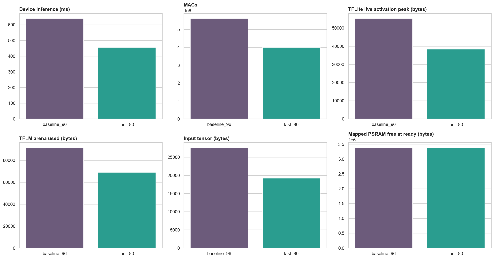
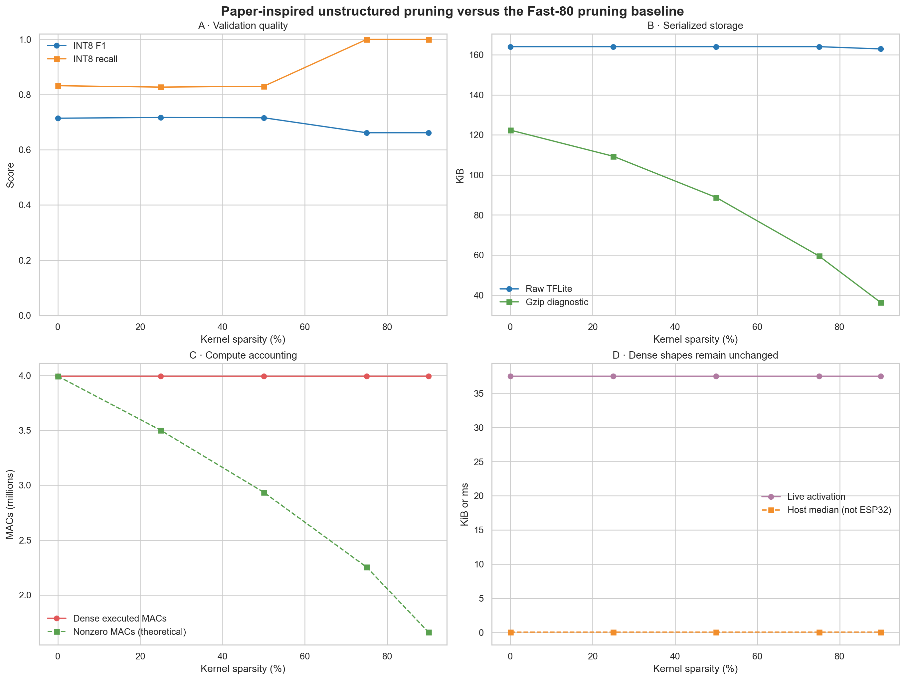

# Visual Wake Words on ESP32

An evidence-driven TinyML project for detecting **person / no person** from an OV3660 camera,
exporting full-INT8 TensorFlow Lite Micro models, and measuring the complete result on
ESP32-CAM and ESP32-S3 hardware.

This repository treats model quality, numerical conversion, memory, latency, and camera-domain
behavior as separate gates. A model is not considered optimized merely because it is sparse,
quantized, smaller on disk, or more accurate on a desktop.

## Contents

- [Project status](#project-status)
- [Detailed engineering reports](#detailed-engineering-reports)
- [System architecture](#system-architecture)
- [Experimental contracts](#experimental-contracts)
- [Baseline and resolution optimization](#baseline-and-resolution-optimization)
- [Quantization](#quantization)
  - [Full-INT8 affine quantization](#full-int8-affine-quantization)
  - [Post-training quantization](#post-training-quantization)
  - [Quantization-aware training](#quantization-aware-training)
  - [Quantization-aware knowledge distillation](#quantization-aware-knowledge-distillation)
- [Pruning](#pruning)
- [Knowledge distillation](#knowledge-distillation)
- [Physical deployment](#physical-deployment)
- [Conclusions and consequences](#conclusions-and-consequences)
- [Repository map](#repository-map)
- [Reproduction](#reproduction)
- [Limitations](#limitations)

## Project status

| Area | Current result | Decision |
|---|---|---|
| Camera task | Binary VWW from COCO-derived RGB images | Working |
| Validated camera platform | AI-Thinker-pinout ESP32-CAM + OV3660 | Complete pipeline working |
| Performance platform | ESP32-S3 rev 0.2, 16 MiB flash, 8 MiB PSRAM | Model and camera probes working |
| ESP32-CAM runtime reference | Fast-80 full INT8 | 416.8 ms production-oriented Invoke |
| Current pruning artifact | Fast-80 iterative unstructured `s50` | Deployed; no causal sparse-speed claim |
| Strongest Student-120 float model | Notebook 03 `same_view_lambda0` | F1 0.7772, PR-AUC 0.8651 |
| Reliable Student-120 integer path | PTQ INT8 | F1 0.7623, PR-AUC 0.8568 in latest contract |
| QAT/QKD export | Integer-only but numerically invalid | Blocked pending Conv-BN/QAT repair |
| Current pruning experiment | Notebook 14 PatDNN-inspired pattern pruning | Implemented; awaiting execution |

The current pruning order is defined by the
[pruning experiment plan](optimization/pruning/PRUNING_TECHNIQUES_PLAN.md). The completed
distillation series and its negative/positive results are consolidated in the
[Knowledge Distillation experiment report](optimization/distillation/DISTILLATION_EXPERIMENT_REPORT.md).

## Detailed engineering reports

The README is the project entry point and evidence map. Technique-level derivations,
implementation decisions, controls, results, failure analysis, and artifact indexes live in
dedicated reports:

| Optimization family | Detailed report | Coverage |
|---|---|---|
| Quantization | [Quantization experiment report](optimization/quantization/QUANTIZATION_EXPERIMENT_REPORT.md) | PTQ, W8A8 QAT, fixed-teacher QAT+KD, staged QKD |
| Pruning | [Pruning experiment report](optimization/pruning/PRUNING_EXPERIMENT_REPORT.md) | Granularity audit, executed unstructured magnitude experiment, and registered Notebook 14 protocol |
| Pruning research plan | [Pruning techniques plan](optimization/pruning/PRUNING_TECHNIQUES_PLAN.md) | Pattern through second-order pruning and device-aware allocation |
| Knowledge distillation | [Distillation experiment report](optimization/distillation/DISTILLATION_EXPERIMENT_REPORT.md) | Every completed Notebook 01–07 technique |
| Physical hardware | [ESP32-CAM versus ESP32-S3](firmware/ESP32_CAM_VS_ESP32_S3_HARDWARE_REPORT.md) | Capacity, camera, memory, kernels, and same-model profiling |

## Experimental contracts

### Dataset and evaluation

| Split | Images | Person fraction |
|---|---:|---:|
| Training | 12,000 | 50.00% |
| Validation | 2,000 | approximately 49.45% |
| Held-out test | 2,000 | 49.05% |

The validation split selects decision thresholds, early stopping, pruning ratios, and
hyperparameters. The test split is opened only after candidate selection. Reports include
accuracy, precision, recall, specificity, F1, ROC-AUC, PR-AUC, calibration, confusion matrices,
and predicted-person rate.

### Model families

| Model | Input | Parameters | MACs | Primary role |
|---|---:|---:|---:|---|
| Teacher-160, MobileNetV1 alpha 0.50 | 160x160x3 | 830,049 | 76.01 M | Distillation teacher |
| Student-120, MobileNetV1 alpha 0.25 | 120x120x3 | 218,801 | 10.49 M | Accuracy-oriented student |
| Baseline-96 | 96x96x3 | 111,793 | 5.62 M | Original MCU reference |
| Fast-80 | 80x80x3 | 111,793 | 3.99 M | Frozen pruning/device reference |

### Evidence levels

| Claim | Required evidence |
|---|---|
| Better classifier | Frozen-test metrics and uncertainty/control comparison |
| Correct INT8 model | Integer-only audit plus float/QAT-to-TFLite parity |
| Smaller deployment | Actual FlatBuffer and arena measurements |
| Less computation | Physically smaller dense graph or supported sparse execution |
| Faster ESP32 inference | Repeated batch-one measurements on the exact flashed artifact |
| Better camera system | Capture-to-decision latency, FPS, memory, and labeled camera tests |

## Baseline and resolution optimization

Fast-80 reduces only spatial resolution; topology and channel counts remain unchanged. This
controlled change demonstrates how spatial dimensions affect MCU compute and activation memory.

| Metric | Baseline-96 | Fast-80 | Change |
|---|---:|---:|---:|
| Input elements | 27,648 | 19,200 | -30.6% |
| MACs | 5,616,256 | 3,993,536 | **-28.9%** |
| Instrumented ESP32-CAM Invoke | 640.534 ms | 455.546 ms | **-28.9%** |
| Measured TFLM arena | 91,596 B | 69,068 B | **-24.6%** |
| Fused live activation peak | 55,296 B | 38,400 B | **-30.6%** |
| INT8 F1 | 0.7234 | 0.7201 | -0.0033 |
| INT8 PR-AUC | 0.8034 | 0.7873 | -0.0162 |



Fast-80 saves work because convolution executes at fewer spatial positions. Equal parameter and
FlatBuffer sizes are expected because resolution does not change the number of weights. Its main
quality cost is specificity: the validation-selected operating point favors recall and produces
more false-positive person decisions.

## Quantization

The full per-technique report—including algorithms, calibration rules, failure modes, conversion
diagnostics, and evidence paths—is
[QUANTIZATION_EXPERIMENT_REPORT.md](optimization/quantization/QUANTIZATION_EXPERIMENT_REPORT.md).

### Full-INT8 affine quantization

For real tensor `x`, quantized integer `q`, scale `s`, and zero point `z`,

$$
q=\operatorname{clip}\left(\operatorname{round}(x/s)+z,-128,127\right),
\qquad \hat{x}=s(q-z).
$$

Every deployment export requires:

- INT8 input and output tensors;
- no float fallback tensors;
- only TFLite Micro/ESP-NN-compatible operators;
- a frozen representative set for calibration;
- validation-selected thresholds after conversion;
- probability and metric parity against the corresponding reference graph.

The normal deployed operator set is `ADD`, `CONV_2D`, `DEPTHWISE_CONV_2D`,
`FULLY_CONNECTED`, `LOGISTIC`, `MEAN`, `MUL`, and `PAD`.

### Post-training quantization

PTQ estimates activation ranges from representative float inputs after training. Weights are
quantized, BatchNorm is folded, and the original model does not learn under rounding noise.
The integer arithmetic and calibration contract follows the deployment formulation in
[Jacob et al., *Quantization and Training of Neural Networks for Efficient Integer-Arithmetic-Only Inference*](https://arxiv.org/abs/1712.05877).
In this project PTQ is implemented as full integer conversion with 500 representative examples,
INT8 boundary tensors, and an explicit no-float-fallback audit.

| PTQ experiment | Float PR-AUC | INT8 PR-AUC | Float F1 | INT8 F1 | Probability MAE | FlatBuffer |
|---|---:|---:|---:|---:|---:|---:|
| Student-120 hard control | 0.8406 | 0.8353 | 0.7512 | 0.7544 | 0.0363 | 304,296 B |
| FitNets candidate | 0.7985 | 0.7992 | 0.7312 | 0.7311 | **0.0141** | 304,944 B |
| Notebook 03 champion, latest export | 0.8651 | **0.8568** | 0.7772 | 0.7623 | — | **303,304 B** |

PTQ is the current reliable Student-120 integer route. It causes a modest ranking/calibration
shift but preserves useful class separation and produces an ESP-compatible dense graph.

### Quantization-aware training

QAT replaces real quantization with a differentiable fake-quantizer during training:

$$
\operatorname{FQ}(x)=s\left[
\operatorname{clip}\left(\operatorname{round}(x/s)+z,q_{min},q_{max}\right)-z
\right].
$$

The forward pass sees rounding and clipping; gradients use a straight-through approximation in
the representable interval. This is the learned-quantization path described by
[Jacob et al.](https://arxiv.org/abs/1712.05877): training adapts weights to the same clipping and
rounding behavior expected from integer inference. In principle, QAT should recover quality that
PTQ loses.

The current W8A8 checkpoints train successfully:

| Keras fake-quantized checkpoint | F1 | PR-AUC | Specificity |
|---|---:|---:|---:|
| Hard QAT | 0.7763 | **0.8661** | 0.7792 |
| Fixed-teacher QAT+KD | 0.7771 | 0.8656 | 0.7566 |
| Full QKD | **0.7783** | 0.8657 | 0.7488 |

However, all QAT-derived TFLite exports collapse to approximately `0.522-0.526` PR-AUC.
Keras-to-TFLite MAE is `0.364-0.419`, far above the `0.03` limit. The leading diagnosis is a
Conv-BatchNorm deployment mismatch: fake quantization observes the pre-BN convolution, while
TFLite folds BN into the deployed convolution.


**Status:** QAT training is promising, but no QAT FlatBuffer is eligible for hardware deployment.
Repair per-layer conversion parity before running another expensive QAT or QKD schedule.

### Quantization-aware knowledge distillation

[QKD](papers/distillation/08_qkd_quantization_aware_kd_2019.pdf) combines teacher supervision
with fake quantization through self-studying, co-studying, and tutoring phases. For softened
teacher and student probabilities `q_t` and `q_s`, the student uses

$$
\mathcal{L}_s=\mathcal{L}_{BCE}(y,p_s)+T^2D_{KL}(q_t\|q_s).
$$

At `T=2`, full QKD does not improve PR-AUC over hard QAT (`0.8657` versus `0.8661`) and trades
specificity for recall. The TFLite result is additionally invalid because of the QAT conversion
failure. See the [QKD outcome report](optimization/distillation/quantization-aware%20distillation/07_QKD_OUTCOME_REPORT.md).

## Pruning

Executed pruning techniques are reported in
[PRUNING_EXPERIMENT_REPORT.md](optimization/pruning/PRUNING_EXPERIMENT_REPORT.md); unexecuted
methods and their registered experimental designs remain in
[PRUNING_TECHNIQUES_PLAN.md](optimization/pruning/PRUNING_TECHNIQUES_PLAN.md).

The pruning program treats a method as a tuple rather than a single label:

```text
granularity
+ importance criterion
+ pruning-ratio policy
+ pruning/recovery schedule
+ runtime representation and hardware support
```

This distinction prevents mathematical sparsity from being reported as MCU acceleration.

### Hardware implications by granularity

| Granularity | Dense graph smaller? | Special sparse kernel? | ESP32 priority |
|---|---:|---:|---:|
| Fine-grained weights | No | Yes | Control experiment |
| Pattern | No | Yes | Compiler/kernel research |
| Vector or M:N | No | Yes | Hardware-specific research |
| Kernel connections | Usually no | Usually yes | Low-medium |
| Filters/channels | **Yes** | No after graph rebuild | **Highest** |
| Layers/blocks | **Yes** | No if shapes remain legal | High |

### Notebook 12 — pruning reference audit

[Notebook 12](optimization/pruning/12_pruning_reference_and_granularity_audit.ipynb) freezes
Fast-80, enumerates legal pruning units, maps MobileNet depthwise-separable dependencies, and
demonstrates why masked zeros do not change dense ESP-NN work.

For physical channel pruning, one channel identity must be removed consistently:

```text
pointwise output channel i
  -> BatchNorm channel i
  -> next depthwise kernel i
  -> next pointwise input channel i
```

### Notebook 13 — unstructured magnitude pruning

The implemented method follows the train-prune-retrain principle from
[Han et al.](papers/pruning/1506.02626v3.pdf) and compares a global one-shot control with a
layer-sensitivity-adjusted iterative schedule.

For scalar weight `w`, magnitude pruning applies

$$
m_i=\mathbf{1}\{|w_i|>\tau\}, \qquad \tilde{w}_i=m_iw_i,
$$

and permanently reapplies the mask during recovery.

| Metric | Fast-80 | Iterative `s50` | Change |
|---|---:|---:|---:|
| Kernel sparsity | 0% | 50% | +50 points |
| INT8 F1 | 0.725 | 0.722 | -0.003 |
| INT8 PR-AUC | 0.787 | 0.781 | -0.006 |
| Raw TFLite bytes | 167,976 | 167,976 | **0%** |
| Gzip diagnostic | 125,325 | 90,900 | -27.5% |
| Dense executed MACs | 3,993,536 | 3,993,536 | **0%** |
| Theoretical nonzero MACs | 3,993,536 | 2,935,819 | -26.5% |
| Fused live activation | 38,400 B | 38,400 B | **0%** |
| Measured arena | 69,068 B | 69,068 B | **0%** |



The selected artifact ran at 416.805 ms in a separate ESP32-CAM capture versus the frozen
Fast-80 profile's 455.546 ms. Because topology, dense MACs, FlatBuffer size, and arena are
unchanged and the captures were not alternating controlled trials, this is not evidence that
ESP-NN skipped sparse weights.

### Notebook 14 — PatDNN-inspired pattern pruning

[Notebook 14](optimization/pruning/14_pattern_based_magnitude_pruning.ipynb) implements the next
registered granularity using the natural-pattern construction from
[PatDNN](papers/pruning/2001.00138v4.pdf). Every eligible 3x3 depthwise kernel retains the center
weight and the three strongest neighbors, so the legal mask space contains

$$
\binom{8}{3}=56
$$

4-entry patterns. The experiment counts these masks in frozen Fast-80, builds the paper's 6-,
8-, and 12-pattern libraries, and assigns each kernel by the L2 projection

$$
p^*=\arg\max_{p\in\mathcal P}\sum_{i,j}W_{ij}^{2}p_{ij}.
$$

The preflight audit finds 10 eligible depthwise layers, 728 spatial kernels, and 6,552 eligible
weights. All candidates prune exactly 5/9 of this eligible domain, then receive the same masked
recovery and full-INT8 conversion. Validation chooses the smallest library meeting recall and F1
gates; the test split is opened only afterward.

This notebook isolates pattern granularity with a magnitude/L2 criterion. It implements PatDNN's
natural-pattern discovery, library sweep, projection, and masked retraining, but does not claim
the paper's extended ADMM, connectivity pruning, FKW storage, compiler reordering, or custom
mobile kernels. Consequently, packed bytes and pattern-aware MACs are theoretical until a
matching ESP-NN pattern kernel exists. Experiment results are pending notebook execution.

### Registered pruning roadmap

| Notebook | Technique | Purpose |
|---:|---|---|
| [14](optimization/pruning/14_pattern_based_magnitude_pruning.ipynb) | PatDNN-inspired pattern magnitude | 4-entry natural patterns, 6/8/12 libraries, packing cost, and unsupported dense-runtime speed |
| 15 | Vector/block and M:N | Compare grouping and 2:4 at equal nonzero budget |
| 16 | Kernel-level | Test irregular channel connectivity barrier |
| 17 | Filter/channel magnitude | First physically narrower dense ESP-NN graph |
| 18 | Layer/block sensitivity | Evaluate legal depth reduction |
| 19 | Network Slimming | BN-scale criterion with sparsity regularization |
| 20 | APoZ and activation energy | Data-dependent channel selection |
| 21 | First-order Taylor | Loss-sensitive channel selection |
| 22 | Regression/reconstruction | LASSO and least-squares preservation |
| 23 | Diagonal second order | Curvature-aware ranking |
| 24 | Ratio allocation | Uniform, sensitivity, and NetAdapt-style policies |
| 25 | Recovery schedule | One-shot, iterative, and regularization |
| 26 | Cross-technique report | Quality/flash/arena/latency/FPS Pareto selection |

The exact paper-backed protocol is in
[PRUNING_TECHNIQUES_PLAN.md](optimization/pruning/PRUNING_TECHNIQUES_PLAN.md). Notebook 14 is
implemented and awaiting execution; Notebook 17 is the first stage expected to reduce stock
dense ESP-NN work.

## Knowledge distillation

The completed series covers response, attention, feature, relation, and quantization-aware KD.
The full mathematics, paper mapping, uncertainty, figures, and failure analysis are in the
[complete distillation report](optimization/distillation/DISTILLATION_EXPERIMENT_REPORT.md).

### Notebook 01 — hard-label Student-120 control

Notebook 01 establishes the causal reference: an ImageNet-initialized MobileNetV1 alpha-0.25
student trained only with binary cross-entropy. The teacher is audited but supplies no loss.

$$
\mathcal{L}_{hard}=-y\log p_s-(1-y)\log(1-p_s).
$$

| Model | F1 | PR-AUC | Specificity | Deployment result |
|---|---:|---:|---:|---|
| Teacher-160 float | 0.8464 | 0.9305 | 0.8685 | Training-only teacher |
| Student-120 float | 0.7512 | 0.8406 | 0.6722 | Valid KD control |
| Student-120 PTQ INT8 | 0.7544 | 0.8353 | 0.6487 | Runs on both boards |

The exact INT8 student measures 1,117.1 ms on ESP32-CAM and 150.9 ms on ESP32-S3 with an
internal arena. It establishes useful teacher headroom but is not an ESP32-CAM latency winner.
[Detailed Notebook 01 analysis](optimization/distillation/DISTILLATION_EXPERIMENT_REPORT.md#kd-notebook-01).

### Notebook 02 — Hinton/MicroNets response KD

[Hinton response distillation](papers/distillation/01_hinton_distilling_knowledge_2015.pdf)
matches temperature-softened teacher and student probabilities. The project uses the
[MicroNets](papers/distillation/09_micronets_tinyml_architectures_2021.pdf) VWW anchor `T=4`,
`lambda=0.5`:

$$
q_t=\sigma(z_t/T),\quad q_s=\sigma(z_s/T),
$$

$$
\mathcal{L}=(1-\lambda)\mathcal{L}_{hard}
+\lambda T^2D_{KL}(\operatorname{Bern}(q_t)\|\operatorname{Bern}(q_s)).
$$

| Model | F1 | PR-AUC | Recall | Specificity |
|---|---:|---:|---:|---:|
| Hard control | **0.7512** | **0.8406** | 0.8063 | **0.6722** |
| Response KD float | 0.7428 | 0.8398 | **0.8359** | 0.6006 |
| Response KD INT8 | 0.7369 | 0.8348 | 0.8236 | 0.6035 |

Response KD increases recall by predicting person more often, but loses F1 and specificity. Its
cached teacher targets were also not guaranteed to describe the exact augmented student view.
The candidate is rejected, and this alignment issue is isolated in Notebook 03.
[Detailed Notebook 02 analysis](optimization/distillation/DISTILLATION_EXPERIMENT_REPORT.md#kd-notebook-02).

### Notebook 03 — response alignment and causal ablation

Notebook 03 samples one semantic RGB augmentation and derives independent teacher `160x160` and
student `120x120` views from it. A `lambda=0` arm determines whether improvement comes from the
corrected data pipeline or from teacher supervision.

| Arm | Teacher loss | F1 | PR-AUC | Specificity | Interpretation |
|---|---:|---:|---:|---:|---|
| Legacy hard control | 0 | 0.7514 | 0.8371 | 0.6222 | Historical contract |
| Same-view `lambda0` | 0 | **0.7772** | **0.8651** | **0.7861** | Project champion |
| Same-view `T2/lambda0.25` | Bernoulli KL | 0.7710 | 0.8635 | 0.6801 | KD adds no gain |

Same-view `lambda0` gains `+0.0281` PR-AUC over the legacy control, with paired 95% interval
`[0.0194, 0.0382]`. Adding KD changes PR-AUC by `-0.0016`. The improvement is therefore caused by
the aligned RGB training contract, not distillation.
[Detailed Notebook 03 analysis](optimization/distillation/DISTILLATION_EXPERIMENT_REPORT.md#kd-notebook-03).


### Notebook 04 — spatial Attention Transfer

[Attention Transfer](papers/distillation/03_attention_transfer_2016.pdf) transfers where the
teacher responds rather than matching its output probability. Channel-reduced spatial attention
is

$$
A(F)=\operatorname{normalize}\left(\sum_c|F_c|^2\right),\qquad
\mathcal{L}_{AT}=\|A(F_t)-A(F_s)\|_2^2.
$$

Teacher and student use `conv_pw_11_relu`; the teacher `10x10` map is resized to the student's
`7x7` map. `beta=4.55377` is calibrated to an initial auxiliary/hard gradient ratio of 0.10.

| Model | F1 | PR-AUC | Recall | Specificity |
|---|---:|---:|---:|---:|
| Attention control | **0.7766** | **0.8633** | 0.8043 | **0.7429** |
| Attention transfer | 0.7746 | 0.8618 | **0.8196** | 0.7144 |

The PR-AUC bootstrap interval crosses zero, while specificity drops 2.85 points. The attention
branch is correctly absent from the deployment graph, but the candidate fails its quality gate.
[Detailed Notebook 04 analysis](optimization/distillation/DISTILLATION_EXPERIMENT_REPORT.md#kd-notebook-04).


### Notebook 05 — FitNets feature hints

[FitNets](papers/distillation/02_fitnets_hints_for_thin_deep_nets_2014.pdf) first trains a
temporary `1x1` regressor to align intermediate teacher and student features:

$$
\mathcal{L}_{hint}=\frac{1}{N}\|F_t-r(F_s)\|_2^2.
$$

The hint stage maps teacher `conv_pw_6_relu` (`10x10x256`) to student `conv_pw_6_relu`
(`7x7x128`). Stage 2 discards the regressor and trains hard BCE plus response KD at `T=3`.

| Model | F1 | PR-AUC | Specificity | Linear CKA to teacher |
|---|---:|---:|---:|---:|
| Random KD control | 0.6689 | 0.6426 | 0.1678 | 0.6172 |
| FitNets + KD | **0.7312** | **0.7985** | **0.5662** | **0.9177** |
| Notebook 03 champion | **0.7772** | **0.8651** | **0.7861** | — |

FitNets is a successful mechanism experiment: hint-checkpoint CKA reaches `0.9562`, and PR-AUC
improves by `+0.1557` over its random-initialized KD control with the entire bootstrap interval
above zero. It is nevertheless globally inferior to the pretrained Notebook 03 champion. Its
INT8 conversion is healthy with probability MAE `0.0141`.
[Detailed Notebook 05 analysis](optimization/distillation/DISTILLATION_EXPERIMENT_REPORT.md#kd-notebook-05).


### Notebook 06 — Similarity-Preserving KD

[Similarity-Preserving KD](papers/distillation/05_similarity_preserving_kd_2019.pdf) transfers
within-batch representation geometry. Flattened feature matrix `Q` produces a row-normalized Gram
matrix:

$$
G=QQ^\top,\qquad \tilde{G}_{i,:}=G_{i,:}/\|G_{i,:}\|_2,
$$

$$
\mathcal{L}_{SP}=\frac{1}{B^2}\|\tilde{G}_t-\tilde{G}_s\|_F^2.
$$

The calibrated `gamma=18.6028` targets an initial relation/hard gradient ratio of 0.10. Response
KD is excluded so the experiment isolates relation transfer.

| Model | F1 | PR-AUC | Recall | Specificity | Relation MSE |
|---|---:|---:|---:|---:|---:|
| SP control | 0.7747 | 0.8620 | 0.8257 | **0.7056** | 0.00322 |
| Similarity preserving | **0.7769** | **0.8636** | **0.8553** | 0.6663 | **0.00123** |

The mechanism works—relation MSE improves substantially—but the PR-AUC interval crosses zero and
specificity falls 3.93 points. It also fails to match the Notebook 03 champion. The candidate is
not promoted.
[Detailed Notebook 06 analysis](optimization/distillation/DISTILLATION_EXPERIMENT_REPORT.md#kd-notebook-06).


### Notebook 07 — Quantization-aware Knowledge Distillation

[QKD](papers/distillation/08_qkd_quantization_aware_kd_2019.pdf) coordinates quantization and KD
in three phases: eight epochs of self-study, six of co-study, and six of tutoring. During
co-study, student and teacher use forward and reverse Bernoulli KL objectives; tutoring freezes
the adapted teacher. Hard QAT and fixed-teacher QAT+KD are equal-budget controls.

| Fake-quantized Keras model | F1 | PR-AUC | Recall | Specificity |
|---|---:|---:|---:|---:|
| Hard QAT | 0.7763 | **0.8661** | 0.7798 | **0.7792** |
| Fixed-teacher QAT+KD | 0.7771 | 0.8656 | 0.7961 | 0.7566 |
| Full QKD | **0.7783** | 0.8657 | **0.8033** | 0.7488 |

QKD does not improve ranking over hard QAT. More importantly, every QAT-derived TFLite export
collapses to approximately `0.522-0.526` PR-AUC with probability MAE `0.364-0.419`. The leading
cause is a Conv-BatchNorm fake-quantization versus TFLite-folding mismatch. PTQ remains usable at
PR-AUC `0.8568`; QAT/QKD artifacts are blocked from deployment.
[Detailed Notebook 07 analysis](optimization/distillation/DISTILLATION_EXPERIMENT_REPORT.md#kd-notebook-07).


### Cross-technique decision

| Technique | Mechanism validated? | Beats matched control? | Beats project champion? | Deployable result? |
|---|---:|---:|---:|---:|
| Response KD | Yes | No | No | Rejected |
| Attention Transfer | Yes | No | No | Rejected |
| FitNets | **Yes** | **Yes** | No | Valid INT8, not promoted |
| Similarity-Preserving KD | **Yes** | Inconclusive | No | Not promoted |
| QKD | Training yes | No versus hard QAT | No | **TFLite invalid** |

The strongest reliable Student-120 result is the hard-label `same_view_lambda0` model. The
decisive improvement came from aligned RGB augmentation, not teacher supervision. FitNets and
SPKD prove that representation transfer occurred, but mechanism success did not translate into
the best classifier.

## Physical deployment

### Board comparison

| Capability | ESP32-CAM | ESP32-S3 |
|---|---:|---:|
| CPU | Dual LX6, 240 MHz | Dual LX7, 240 MHz + 128-bit vectors |
| Flash | 4 MiB, 40 MHz | 16 MiB, 80 MHz |
| Mapped PSRAM | approximately 4 MiB at 40 MHz | 8 MiB octal at 80 MHz |
| Camera | OV3660 validated | OV3660 validated |
| Maximum sensor capture | 2048x1536 | 2048x1536 JPEG verified |
| Fast-80 Invoke | 455.546 ms instrumented | **67.105 ms internal arena** |
| Fast-80 arena used | 69,068 B | 83,420 B |
| Complete camera dashboard | Working | Not yet ported |

The same Fast-80 artifact is 6.78x faster on the S3 internal-arena profiler than the saved
ESP32-CAM instrumented profile. This is a model-only comparison, not a complete-camera speedup.

### Student-120 deployment cost

| Metric | ESP32-CAM | ESP32-S3 internal | ESP32-S3 PSRAM |
|---|---:|---:|---:|
| Invoke mean | 1,117.123 ms | **150.906 ms** | 176.005 ms |
| Model-only rate | approximately 0.90/s | 6.63/s | 5.68/s |
| Measured arena | 142,444 B | 159,212 B | 159,212 B |

Student-120 is accurate enough to be interesting and practical on the S3, but it is not an
ESP32-CAM latency Pareto winner. The final S3 application still needs camera preprocessing,
Wi-Fi, dashboard, memory-fragmentation, and end-to-end FPS measurements.

### Firmware and profiling

- [ESP32-CAM firmware guide](firmware/esp32_cam_vww/README.md)
- [ESP32-CAM hardware capacity](firmware/esp32_cam_vww/HARDWARE_CAPACITY_REPORT.md)
- [ESP32-S3 capacity report](artifacts/device_profiles/esp32_s3_capacity/DEVICE_CAPACITY_REPORT.md)
- [ESP32-CAM versus ESP32-S3](firmware/ESP32_CAM_VS_ESP32_S3_HARDWARE_REPORT.md)
- [Fast-80 per-operator profile](artifacts/device_profiles/fast_80/DEVICE_LAYER_PROFILE_REPORT.md)
- [Student-120 per-operator profile](artifacts/device_profiles/student_120_hard_control/DEVICE_LAYER_PROFILE_REPORT.md)

## Conclusions and consequences

1. **Resolution is a real hardware lever.** Moving 96 to 80 pixels removes approximately 29% of
   MACs and measured instrumented latency because the dense graph executes less spatial work.
2. **PTQ is currently reliable; QAT export is not.** Continue using PTQ for pruning deployments
   until the Conv-BN fake-quant/TFLite mismatch is repaired.
3. **Unstructured zeros are not an ESP-NN optimization.** They preserve quality and compress well
   offline, but they do not change dense shapes, MACs, or arena requirements.
4. **Physical channel or block removal is the main MCU pruning route.** It can reuse existing
   dense INT8 kernels while reducing real tensor dimensions.
5. **KD did not produce the champion.** Correct shared-view preprocessing delivered the largest
   Student-120 improvement; teacher-loss methods did not exceed it.
6. **Specificity cannot be hidden by recall.** Several experiments increased recall by predicting
   person too often—the same failure mode observed on real camera backgrounds.
7. **ESP32-S3 changes the feasible architecture set.** Vectorized ESP-NN makes Student-120
   model-only inference practical, but the older ESP32-CAM still benefits strongly from Fast-80.
8. **Every optimization needs an end-to-end gate.** Final promotion requires frozen-test quality,
   integer parity, exact model bytes, measured arena, Invoke latency, preprocessing latency, and
   complete camera FPS.

## Repository map

```text
notebooks/                         baseline data -> train -> evaluate -> export -> profile
optimization/high_resolution/      160x160 teacher experiments
optimization/distillation/         KD notebooks, plans, debugging, consolidated report
optimization/pruning/              pruning audit, techniques, and roadmap
papers/distillation/                local KD/TinyML paper library
papers/pruning/                     local pruning paper library
artifacts/                           models, metrics, figures, hashes, device captures
firmware/esp32_cam_vww/             validated ESP32-CAM application
firmware/esp32_s3_vww/              ESP32-S3 model target
scripts/                             training, export, flashing, and profiling helpers
configs/                             immutable experiment configurations
```

### Principal notebooks

| Phase | Notebooks |
|---|---|
| Baseline | `00_project_setup.ipynb` through `09_report_and_deployment.ipynb` |
| Hardware | `10_device_layer_profiling.ipynb`, `11_model_version_comparison.ipynb` |
| Pruning | [12 audit](optimization/pruning/12_pruning_reference_and_granularity_audit.ipynb), [13 unstructured magnitude](optimization/pruning/13_unstructured_magnitude_pruning.ipynb), [14 pattern-based magnitude](optimization/pruning/14_pattern_based_magnitude_pruning.ipynb) |
| Distillation | [01–07 technique sequence](optimization/distillation/DISTILLATION_EXPERIMENT_REPORT.md#artifact-index) |
| High resolution | [Teacher-160](optimization/high_resolution/01_high_resolution_teacher_160.ipynb), targeted/full COCO experiments |

## Reproduction

### Python environment

```bash
python3 -m venv .venv
source .venv/bin/activate
python -m pip install -e '.[dev]'
jupyter lab
```

Run notebooks from a fresh kernel. Reuse checkpoints only when the notebook's runtime contract,
manifest hash, model hash, configuration hash, and paper hash match.

### Train the frozen Fast-80 reference

```bash
python scripts/train_fast_vww.py --config configs/fast_80.yaml
```

### Build and flash ESP32-CAM

```bash
source scripts/activate_esp_idf.sh
python scripts/verify_firmware_assets.py
./scripts/build_esp32_firmware.sh
./scripts/flash_esp32_firmware.sh /dev/cu.YOUR_SERIAL_PORT --monitor
```

### Profile an exact model artifact

```bash
source scripts/activate_esp_idf.sh
scripts/profile_esp32_model.sh \
  artifacts/fast_80/models/vww_mobilenetv1_80_int8.tflite \
  80 fast_80 /dev/cu.YOUR_SERIAL_PORT
```

The profiler uses batch one, warm-up invocations, repeated measurements, exact artifact hashes,
per-operator timing, and memory accounting. Desktop timing must not be substituted for ESP32
latency.

## Limitations

- COCO-domain metrics do not establish production accuracy on OV3660 camera frames.
- The camera uses device-side color/brightness correction and temporal policy; these must remain
  consistent with any deployment calibration.
- Flash illumination changes the input distribution and must stay disabled during controlled
  profiling unless illumination itself is the experiment.
- Current QAT/QKD TFLite files are rejected despite being integer-only.
- Unstructured pruning has no supported sparse ESP-NN execution path in this project.
- ESP32-S3 model-only results are not yet equivalent to a full camera/Wi-Fi/dashboard benchmark.
- Thresholds are model- and domain-specific; `0.5` is not assumed to be correct.
