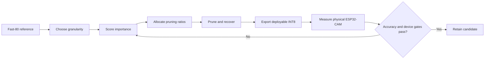

# Pruning techniques and ESP32-CAM experiment plan

## Purpose and reset boundary

This document starts a new pruning phase from the frozen **Fast-80** reference model. Earlier
QAT and pruning experiments, notebooks, reports, helper code, and derived models have been
removed. The retained reference is the 80x80x3, batch-one, full-INT8 deployment whose physical
hardware capacity was measured before pruning.

Quantization-aware training is intentionally outside the first pruning phase. A pruned candidate
may still be converted with the existing full-INT8 post-training exporter so it can run on the
ESP32-CAM, but that conversion is a deployment step rather than a quantization experiment.

## The key idea: pruning methods are combinations of independent decisions

Terms such as magnitude pruning, channel pruning, iterative pruning, and automatic pruning do
not describe alternatives at the same level. A complete pruning method is a tuple:

```text
pruning method =
    granularity
  + importance criterion
  + pruning-ratio policy
  + pruning schedule/recovery
  + runtime representation and hardware support
```

For example:

```text
Channel × L1 filter magnitude × sensitivity-derived layer ratios
        × iterative prune/fine-tune × dense ESP-NN kernels
```



This separation is essential for fair experiments. Comparing unstructured magnitude pruning
against channel-level APoZ pruning changes both granularity and criterion, so the result cannot
tell us which decision caused the difference.

## Frozen reference and success criteria

| Property | Fast-80 reference |
|---|---:|
| Input | 1x80x80x3 INT8 |
| Parameters | 111,793 |
| Estimated MACs | 3,993,536 |
| TFLite model | 167,976 B |
| Fused-TFLite live activation peak | 38,400 B |
| Measured TFLM arena use | 69,068 B |
| Measured inference | approximately 417 ms |
| Complete pipeline | approximately 1.67 fps |

Every notebook must report at least:

- validation-selected threshold, accuracy, precision, recall, specificity, F1, ROC-AUC, PR-AUC,
  calibration error, confusion matrix, and person/no-person prediction rate;
- nonzero parameters, physical parameters, model bytes, operators, estimated MACs, activation
  liveness, and theoretical sparsity;
- batch-one ESP32 Invoke latency, per-operator latency, actual tensor-arena use, internal SRAM,
  mapped PSRAM, preprocessing time, complete period, and complete pipeline FPS;
- whether the result is only a sparse mask, a compressed representation, or a physically
  smaller dense graph.

A reduction in zero-counted MACs is not a speedup. Only a physical-device measurement supports
an ESP32 latency or FPS claim.

## Axis 1 — pruning granularity

### 1. Fine-grained or unstructured weight pruning

Individual scalar weights are removed, usually by applying a binary mask:

```text
dense kernel                 unstructured sparse kernel
[a b c]                      [a 0 c]
[d e f]          ->          [0 e 0]
[g h i]                      [g 0 i]
```

The classic train-prune-retrain procedure is described by Han et al. in
[Learning both Weights and Connections for Efficient Neural Networks](https://arxiv.org/abs/1506.02626).
It offers high flexibility and often preserves accuracy at high sparsity, but creates irregular
memory access and requires a sparse encoding and sparse kernel to skip zero multiplications.

**ESP32-CAM plan:** implement this first as a scientific control at global sparsities of 25%,
50%, 75%, and 90%. Measure accuracy, gzip/sparse-encoding size, and dense TFLite latency. We
expect no meaningful ESP-NN latency or activation-memory improvement because tensor shapes stay
unchanged. Do not promote it unless a custom sparse INT8 kernel and model representation are
implemented and measured.

### 2. Pattern-based pruning

Pattern pruning limits each small convolution kernel to a set of permitted masks. It occupies a
middle ground between arbitrary sparsity and fully structured removal. PatDNN couples pattern
selection with compiler transformations such as kernel reordering and compressed storage; its
speedups depend on that algorithm/compiler co-design, not merely on zeros in a dense tensor.
See [PatDNN: Achieving Real-Time DNN Execution on Mobile Devices with Pattern-based Weight Pruning](https://arxiv.org/abs/2001.00138).

**ESP32-CAM plan:** restrict the initial study to 3x3 depthwise kernels and a small, symmetric
pattern library. Report accuracy and theoretical nonzero MACs, but mark device acceleration as
unsupported unless an ESP-NN-compatible pattern kernel is written. Pattern pruning is a later
systems experiment, not an early deployment candidate.

### 3. Vector-level, block-sparse, and M:N pruning

Vector-level pruning removes contiguous groups of weights. M:N pruning keeps exactly M values
within every group of N—for example, NVIDIA 2:4 keeps two values in each group of four. This
regularity reduces index overhead and suits hardware designed for the exact pattern. Vector-wise
algorithm/hardware co-design is studied in
[Sparse Tensor Core](https://doi.org/10.1145/3352460.3358269), while a software-oriented vector
layout is studied in
[Accelerating Sparse Convolution with Column Vector-Wise Sparsity](https://proceedings.neurips.cc/paper_files/paper/2022/hash/c383e44d9a878d1982d9abb838bd5d8a-Abstract-Conference.html).
NVIDIA's [A100 architecture whitepaper](https://www.nvidia.com/content/dam/en-zz/Solutions/Data-Center/nvidia-ampere-architecture-whitepaper.pdf)
documents hardware support for its exact 2:4 representation.

**ESP32-CAM plan:** test 2:4 magnitude pruning only as a portability and accuracy experiment.
The original ESP32 has no NVIDIA Sparse Tensor Core, and the documented ESP-NN interface does
not provide a 2:4 sparse convolution. Therefore, do not predict a 2x ESP32 speedup. A real
speed experiment would require a custom packed format and custom INT8 convolution kernel.

### 4. Kernel-level pruning

For a convolution tensor `[kh, kw, Cin, Cout]`, kernel-level pruning removes the complete
`kh × kw` connection between one input channel and one output channel. It is more regular than
scalar pruning but can leave an irregular connectivity matrix between channels. Structured
kernel/filter/channel/depth regularization is developed in
[Learning Structured Sparsity in Deep Neural Networks](https://arxiv.org/abs/1608.03665).

**ESP32-CAM plan:** treat kernel pruning as an analysis experiment for pointwise convolutions.
Standard dense ESP-NN kernels will still execute the full input-output channel product unless
the removed kernels can be converted into complete channel removal. Promote only candidates
that can be rebuilt as smaller dense tensors.

### 5. Filter- and channel-level pruning

Removing an output filter deletes one output feature map; the corresponding input channel must
also be removed from dependent layers. The resulting tensors remain dense but narrower, so
ordinary dense kernels can perform less work. Li et al. use filter L1 magnitude in
[Pruning Filters for Efficient ConvNets](https://arxiv.org/abs/1608.08710). Channel-level
training with sparse BatchNorm scales is introduced by
[Network Slimming](https://openaccess.thecvf.com/content_iccv_2017/html/Liu_Learning_Efficient_Convolutional_ICCV_2017_paper.html).

Depthwise-separable MobileNet requires special dependency handling:

```text
pointwise output channel i
        ↓
BatchNorm channel i
        ↓
next depthwise kernel i
        ↓
next pointwise input channel i
```

All four pieces must be removed together. Zeroing only one tensor does not create a valid
smaller graph.

**ESP32-CAM plan:** this is the highest-priority granularity. Compare multiple criteria while
holding the same channel-removal budget fixed. Rebuild real dense Keras/TFLite tensors, verify
dependency propagation, and measure the board after every selected candidate.

### 6. Layer- and block-level pruning

This removes a complete layer or repeated computational block and reduces network depth.
It is hardware friendly when adjacent tensor shapes remain compatible. Layer-depth structured
sparsity appears in Wen et al.'s structured sparsity work, and complete structure selection is
studied in
[Data-Driven Sparse Structure Selection](https://openaccess.thecvf.com/content_ECCV_2018/papers/Zehao_Huang_Data-Driven_Sparse_Structure_ECCV_2018_paper.pdf).

**ESP32-CAM plan:** profile every legal single-block removal, not only late repeated blocks.
Classify candidates into shape-preserving removal and transition-block redesign. Compare equal
resource reductions where possible, then test two-block combinations only after single-block
sensitivity is known.

### Granularity recommendation

| Granularity | Dense graph becomes smaller? | Special sparse kernel needed? | ESP32 priority |
|---|---:|---:|---:|
| Fine-grained weight | No | Yes | Low; control experiment |
| Pattern | No | Yes | Low; compiler/kernel research |
| Vector or M:N | No | Yes | Low; hardware-specific research |
| Kernel connection | Usually no | Usually yes | Low-medium |
| Filter/channel | Yes | No | **Highest** |
| Layer/block | Yes | No, if shapes remain valid | **High** |

## Axis 2 — pruning criterion

The criterion assigns an importance score. It is separate from the granularity: magnitude can
score scalar weights, complete kernels, filters, or channels.

### 1. Magnitude-based criterion

Common scores are `|w|` for individual weights and L1/L2 norms for groups:

```text
scalar score:  s(w) = |w|
channel L1:    s(c) = sum |W[..., c]|
channel L2:    s(c) = sqrt(sum W[..., c]^2)
```

It is inexpensive, deterministic, and data-free, but it ignores activations and loss
sensitivity.

**Plan:** first run unstructured global magnitude as the negative hardware control. Then run
channel L1 and channel L2 with the same per-stage channel counts. This isolates whether the
criterion matters while granularity and ratio remain fixed.

### 2. Scaling-based criterion

Network Slimming uses the BatchNorm scale `γ` as a channel gate and adds an L1 penalty:

```text
loss = task_loss + λ × sum(|γ|)
importance(channel c) = |γc|
```

Small scales identify channels that training learned to suppress. This is not equivalent to
ranking ordinary pretrained BatchNorm values without sparsity training; the regularized
training step is part of the method.

**Plan:** start from the identical Fast-80 float checkpoint, train several registered `λ`
values, plot the gamma distributions, prune to the same budgets used by magnitude pruning,
fine-tune with equal compute, and compare both offline quality and physical latency.

### 3. Activation- and neuron-selection criteria

“Selection of neurons to prune” is an umbrella problem, not one score. Candidate signals
include mean activation, variance, class-conditioned activation, entropy, mutual information,
or the estimated loss change when a neuron is removed.

For this VWW model, selection should use both person and no-person samples. A neuron active
only on one class can be valuable even if its global mean is small.

**Plan:** collect deterministic activation statistics on the frozen validation set, rank
channels separately per layer, and compare mean absolute activation and class-balanced
activation energy at fixed channel budgets. Camera frames may be a later robustness slice but
must not replace the held-out model-selection protocol.

### 4. Percentage-of-zero or APoZ criterion

APoZ measures how often a post-ReLU neuron/channel is exactly zero. High APoZ suggests that the
unit rarely contributes. The method is described in
[Network Trimming](https://arxiv.org/abs/1607.03250), which alternates pruning and retraining.

```text
APoZ(c) = number of zero activations for channel c / total activations for channel c
```

**Plan:** record per-channel APoZ after ReLU6 over the complete validation set. Compare APoZ
against activation energy and channel magnitude using identical pruning ratios. Because camera
domain shift can alter ReLU occupancy, add a labeled camera-frame diagnostic after COCO-domain
selection.

### 5. First-order Taylor criterion

Taylor pruning estimates the loss change caused by removing a unit from activation-gradient
products. A commonly used group score is related to `|activation × gradient|`. See
[Pruning Convolutional Neural Networks for Resource Efficient Inference](https://arxiv.org/abs/1611.06440).

**Plan:** accumulate class-balanced Taylor scores on a fixed calibration subset. Compare with
magnitude/APoZ at the same physical channel schedule. This is more expensive than magnitude but
still practical for Fast-80.

### 6. Second-order criterion

Second-order methods use curvature to approximate the loss increase after removal. Optimal
Brain Damage uses a diagonal Hessian approximation, while Optimal Brain Surgeon uses inverse
Hessian information and compensates remaining weights. The classical OBS reference is
[Second Order Derivatives for Network Pruning](https://www.babak.caltech.edu/pubs/neural.html).

The attraction is interaction awareness; the cost is memory, numerical stability, and
calibration compute. A full Hessian over all Fast-80 parameters is unnecessary and expensive.

**Plan:** begin with diagonal empirical-Fisher or Gauss-Newton approximations per channel.
Compare its ranking to Taylor and magnitude. Only attempt blockwise inverse-Hessian updates if
the diagonal experiment produces a clear quality advantage.

### 7. Regression- and reconstruction-based criterion

Regression pruning chooses channels that best reconstruct a layer's output after pruning.
He et al. alternate LASSO channel selection and least-squares reconstruction in
[Channel Pruning for Accelerating Very Deep Neural Networks](https://openaccess.thecvf.com/content_iccv_2017/html/He_Channel_Pruning_for_ICCV_2017_paper.html).
ThiNet instead uses statistics from the next layer in
[ThiNet](https://openaccess.thecvf.com/content_ICCV_2017/papers/Luo_ThiNet_A_Filter_ICCV_2017_paper.pdf).

**Plan:** target the expensive pointwise convolutions. Cache a registered calibration subset,
solve LASSO for input-channel selection, reconstruct surviving weights with least squares, and
then rebuild dependencies through BatchNorm and the following depthwise/pointwise layers.
Measure reconstruction error before fine-tuning so its contribution is visible.

### Criterion experiment order

| Order | Criterion | Why |
|---:|---|---|
| 1 | Weight/group magnitude | Cheapest reproducible reference |
| 2 | Scaling/BatchNorm gamma | Strong structured baseline |
| 3 | APoZ and activation energy | Uses actual data behavior |
| 4 | First-order Taylor | Direct loss-sensitivity approximation |
| 5 | Regression/reconstruction | Explicitly preserves layer outputs |
| 6 | Diagonal second order | Highest complexity; run only after simpler baselines |

## Axis 3 — selecting pruning ratios

### Uniform and global ratios

A uniform policy removes the same percentage from every eligible layer. A global policy ranks
all groups together. Both are useful baselines but can over-prune narrow or sensitive layers.

**Plan:** use 10%, 20%, 30%, and 40% structured channel reductions as screening points while
respecting dependency constraints and valid tensor sizes. For unstructured magnitude, also test
50%, 75%, and 90% because fine-grained sparsity usually tolerates higher nominal ratios.

### Layer-sensitivity-derived ratios

Prune one layer at a time at several ratios, measure validation loss/PR-AUC degradation, then
allocate more pruning to insensitive layers under a global resource budget.

**Plan:** produce a sensitivity heatmap for every pointwise output stage. Use measured
per-operator ESP32 time—not parameters alone—as the resource benefit. Protect the stem, final
classifier interface, and any layer whose small removal causes disproportionate quality loss.

### Automatic pruning-ratio search

AMC uses reinforcement learning to find compression policies
([AMC](https://arxiv.org/abs/1802.03494)). MorphNet uses a resource-weighted sparsifying
regularizer ([MorphNet](https://openaccess.thecvf.com/content_cvpr_2018/html/Gordon_MorphNet_Fast__CVPR_2018_paper.html)).
NetAdapt progressively simplifies a model using direct device measurements rather than relying
only on MACs
([NetAdapt](https://openaccess.thecvf.com/content_ECCV_2018/html/Tien-Ju_Yang_NetAdapt_Platform-Aware_Neural_ECCV_2018_paper.html)).

**ESP32-CAM plan:** use a small NetAdapt-style search after the best criterion is known. At each
round, generate a limited set of channel reductions, briefly recover them, and profile only the
Pareto candidates on the board. A full reinforcement-learning search is excessive for this
small network and slow physical deployment loop.

## Axis 4 — pruning and recovery schedule

### One-shot pruning and fine-tuning

Prune directly to the target ratio, then fine-tune. It is cheap and appropriate for low ratios,
but a large topology shock can make recovery difficult.

**Plan:** use it for initial 10–30% screening with identical epochs, learning rate, early
stopping, augmentations, and validation selection for all criteria.

### Iterative pruning

Han et al.'s train-prune-retrain loop removes weights gradually. Iterative magnitude pruning is
also central to the
[Lottery Ticket Hypothesis](https://arxiv.org/abs/1803.03635), although lottery-ticket rewinding
asks a different question from deployment fine-tuning.

**Plan:** compare one-shot 30% channel pruning against three 10% rounds using the winning
criterion. Save metrics before pruning, immediately after each pruning event, and after each
recovery so pruning damage and recovery are not conflated.

### Regularization-driven pruning

L1 scaling penalties or group LASSO encourage complete structures to approach zero during
training. Network Slimming and Structured Sparsity Learning are the principal references.

**Plan:** register regularization strengths before training, use equal maximum training budgets,
and select the regularizer on validation evidence. Do not compare a heavily trained regularized
model with an unrecovered one-shot baseline.

### Fine-tuning rules for every structured experiment

1. Transfer all shape-compatible weights and audit every removed dependency.
2. Measure the immediate post-prune quality before recovery.
3. Fine-tune with a lower learning rate and early stopping on validation PR-AUC.
4. Lock the threshold using validation predictions.
5. Open the held-out test split once for the selected candidate.
6. Export using the same full-INT8 PTQ protocol and representative sample count.
7. Reject float/INT8 candidates with unexpected operators or poor probability parity.
8. Profile the exact exported FlatBuffer on the ESP32-CAM.

## Axis 5 — system and hardware support for sparsity

Sparse acceleration is a contract among the pruning pattern, storage format, compiler/runtime,
and hardware. A model does not become faster merely because many stored values equal zero.

### Examples from the literature

- [EIE](https://arxiv.org/abs/1602.01528) is a custom accelerator for compressed sparse
  matrix-vector multiplication, weight sharing, and zero-activation skipping.
- [Cnvlutin](https://ieeexplore.ieee.org/document/7551378/) skips ineffectual zero-valued neuron
  multiplications with a specialized architecture.
- NVIDIA Ampere Sparse Tensor Cores accelerate the exact 2:4 weight pattern documented in the
  A100 whitepaper; that result does not transfer automatically to other CPUs or MCUs.
- [TorchSparse](https://proceedings.mlsys.org/paper_files/paper/2022/hash/c48e820389ae2420c1ad9d5856e1e41c-Abstract.html)
  and [PointAcc](https://arxiv.org/abs/2110.07600) target spatial sparsity in 3D point-cloud
  networks. Their sparse coordinates, mapping, gather, and scatter workload is different from
  zero activations in this dense 2D camera classifier.

### Implication for the current ESP32-CAM

The official [ESP-NN repository](https://github.com/espressif/esp-nn) documents optimized
INT8 convolution, depthwise convolution, fully connected, pooling, and elementwise kernels for
ESP32. Its documented interface and benchmark paths are dense; no general sparse-weight,
pattern, or M:N convolution representation is documented. Therefore:

```text
masked zeros + unchanged tensor shapes
    → normally unchanged dense ESP-NN work

physically fewer channels/filters/blocks
    → smaller dense tensors and fewer dense operations
```

The second path is the primary deployment route. The first path remains useful research only
if paired with a custom kernel and a measured end-to-end benefit.

### Hardware claim levels

| Claim level | Required evidence |
|---|---|
| Accuracy-preserving sparsity | Mask statistics plus locked test metrics |
| Storage compression | Actual serialized/packed bytes including indices |
| Theoretical compute reduction | Nonzero MAC calculation with stated execution assumptions |
| Runtime acceleration | Kernel/runtime that skips the removed work plus measured latency |
| ESP32 deployment improvement | Exact firmware, batch-one board profile, arena, and pipeline FPS |

## Notebook roadmap

Each notebook will contain the full data-to-device path, but only one new pruning decision will
change at a time.

| Notebook | Controlled experiment | Intended conclusion |
|---:|---|---|
| [12](pruning/12_pruning_reference_and_granularity_audit.ipynb) | Pruning reference and granularity audit | Freeze Fast-80 and enumerate legal groups/dependencies |
| [13](pruning/13_unstructured_magnitude_pruning.ipynb) | Unstructured magnitude pruning | Establish accuracy/compression control and verify dense ESP-NN limitation |
| 14 | Structured channel magnitude | Establish first physically smaller dense model |
| 15 | Scaling-based Network Slimming | Compare learned BN scales against magnitude at equal budgets |
| 16 | APoZ and activation-energy channel pruning | Evaluate data-dependent neuron selection |
| 17 | First-order Taylor channel pruning | Evaluate loss-sensitive selection |
| 18 | Regression/reconstruction channel pruning | Evaluate LASSO/least-squares preservation |
| 19 | Diagonal second-order channel pruning | Test whether curvature justifies its complexity |
| 20 | Layer/block sensitivity | Test all legal single-block removals and selected combinations |
| 21 | Iterative versus one-shot recovery | Isolate recovery schedule using the winning criterion |
| 22 | Automatic device-aware ratio allocation | NetAdapt-style search using physical latency |
| 23 | Cross-technique report | Select Pareto candidates across quality and hardware metrics |

Pattern, vector, and M:N pruning should be placed in a separate sparse-kernel research phase
unless custom ESP32 kernels are authorized. They must not delay the dense structured path that
ESP-NN can use immediately.

## Required controls and reproducibility

- Freeze train, validation, and held-out test manifests and record their hashes.
- Freeze the Fast-80 float checkpoint and deployment TFLite hash.
- Use the validation split for criterion hyperparameters, ratios, thresholds, and early stopping.
- Never rank or select candidates with held-out test results.
- Use identical representative samples for all full-INT8 exports.
- Record random seed, TensorFlow version, config, training time, and exact model SHA-256.
- Compare criteria at identical physical channel counts before allowing automatic ratios.
- Distinguish nominal sparsity, physical graph reduction, packed storage reduction, and measured
  runtime reduction in every table and chart.
- Use the same ESP-IDF, ESP-TFLite-Micro, ESP-NN, CPU frequency, arena placement, warm-ups, and
  measured invocation count for device comparisons.

## Recommended starting point

Start with [Notebook 12](pruning/12_pruning_reference_and_granularity_audit.ipynb), which produces
a dependency graph and a pruning-unit inventory for every convolution. Then run
[Notebook 13](pruning/13_unstructured_magnitude_pruning.ipynb) as the unstructured magnitude
control. This ordering is
deliberate: it will empirically demonstrate why “many zeros” and “faster on ESP32” are different
claims before we invest in structured channel techniques.

The first likely deployment improvement is Notebook 14—physical channel pruning using L1/L2
group magnitude—because it changes dense tensor dimensions without requiring a new sparse
runtime. The later criteria can then be compared against that exact structural baseline.
