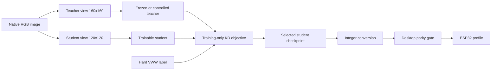
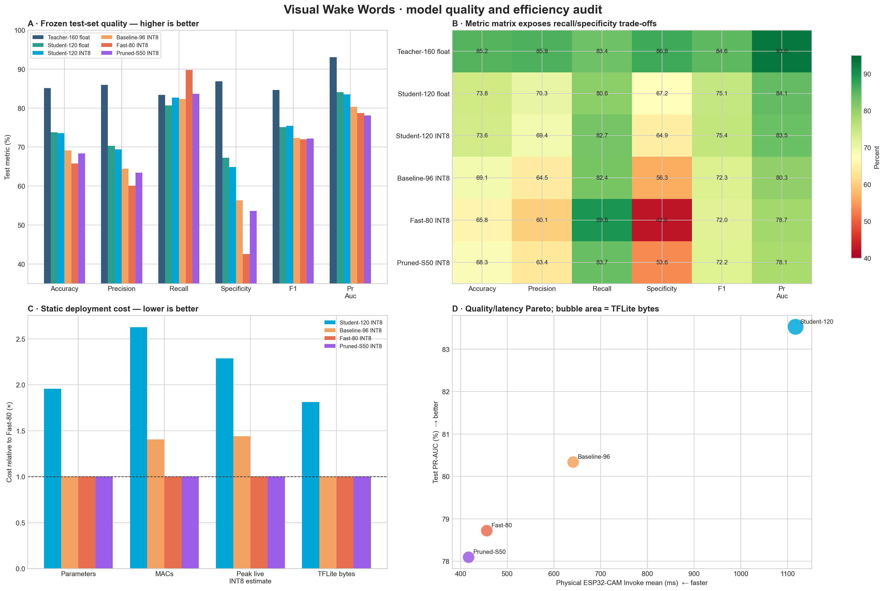
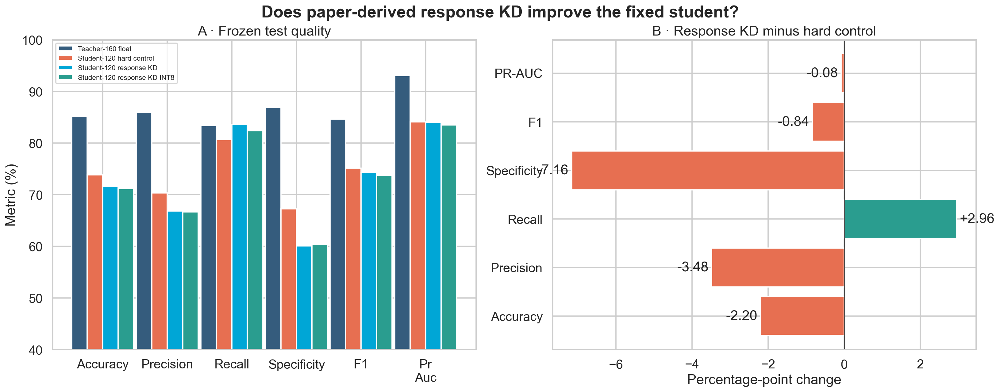
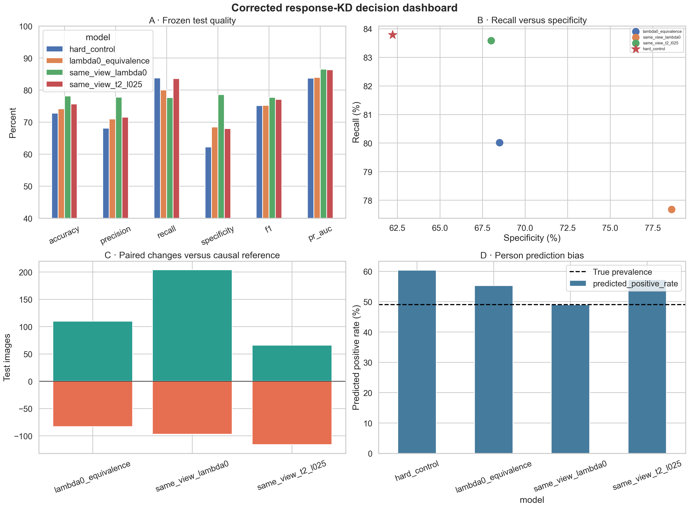
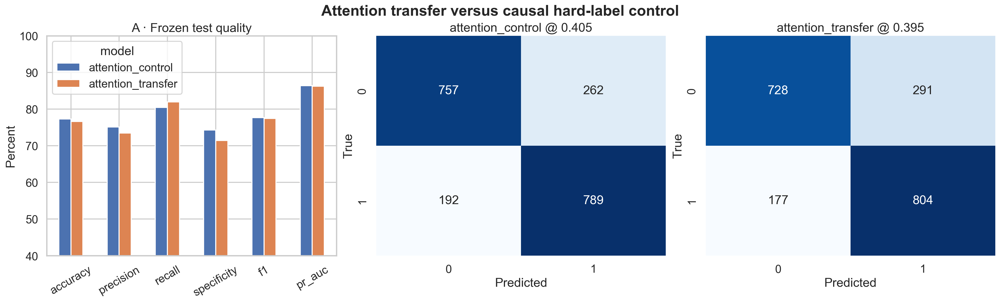
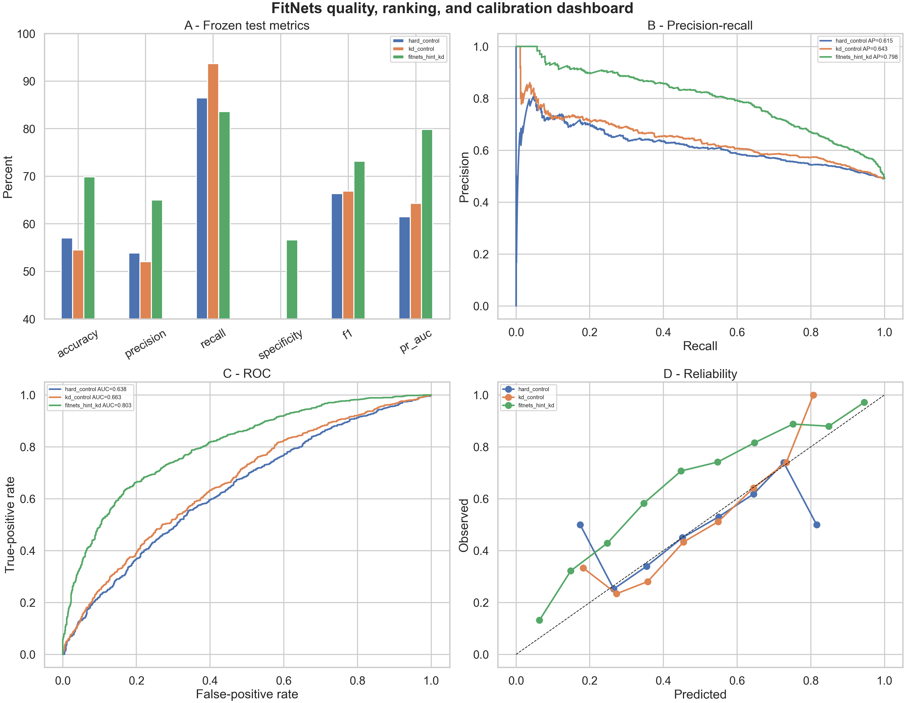
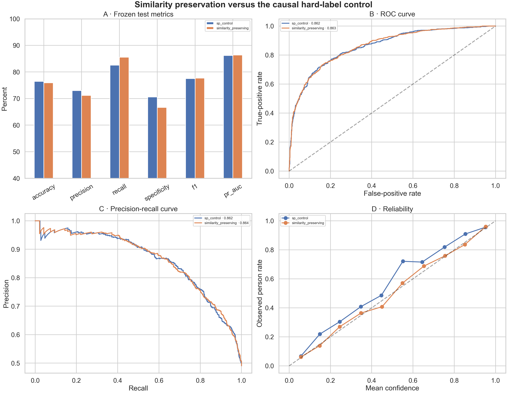
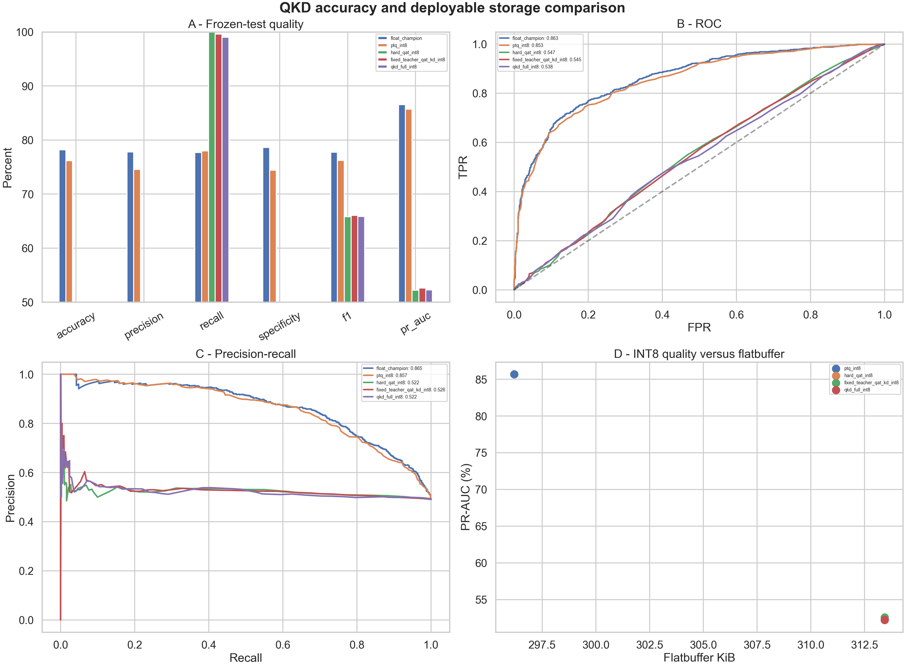

# Knowledge Distillation experiment report

## Scope and decision

This report consolidates the completed Visual Wake Words knowledge-distillation experiments for
the `160x160` teacher and `120x120` student. It reports the implemented mathematics, paper
lineage, experimental controls, frozen-test results, deployment cost, failure analysis, and the
decision attached to each notebook.

The central result is straightforward:

> The project validated several distillation mechanisms, but no teacher-loss technique beat the
> strongest Student-120 training recipe. The current Student-120 champion is Notebook 03's
> `same_view_lambda0`, a hard-label model trained with the corrected shared-view RGB pipeline.

Distillation is therefore retained as research evidence, not as the current deployment route.
Further relation-based KD is paused. The project returns to the registered pruning sequence after
repairing the QAT export path when quantization work resumes.

## Contents

- [Experimental contract](#experimental-contract)
- [Common mathematics](#common-mathematics)
- [Completed experiments](#completed-experiments)
- [Cross-technique comparison](#cross-technique-comparison)
- [Hardware and efficiency interpretation](#hardware-and-efficiency-interpretation)
- [Lessons and consequences](#lessons-and-consequences)
- [Artifact index](#artifact-index)

## Experimental contract

| Role | Architecture | Input | Parameters | Estimated MACs | Purpose |
|---|---|---:|---:|---:|---|
| Teacher | MobileNetV1, alpha 0.50 | 160x160x3 RGB | 830,049 | 76.01 M | Training-only supervision |
| Student | MobileNetV1, alpha 0.25 | 120x120x3 RGB | 218,801 | 10.49 M | Distillation target |
| Device reference | Fast-80 MobileNetV1-style | 80x80x3 RGB | 111,793 | 3.99 M | Physical TinyML baseline |

The primary split contains 12,000 training, 2,000 validation, and 2,000 held-out test images.
Thresholds are selected on validation data. Candidate selection and hyperparameters must not use
the test set. Teacher and student consume the same native semantic image through independent
`160x160` and `120x120` resize branches.

The accepted teacher reference records test F1 `0.8464` and PR-AUC `0.9305`. The original
Student-120 hard control records F1 `0.7512` and PR-AUC `0.8406`, leaving approximately nine
PR-AUC points of teacher headroom.

Distillation components are training-only. A correct exported model contains only the student,
so response, attention, feature, and relational KD do not reduce parameters, MACs, activation
memory, or device latency by themselves.

## Common mathematics

### Hard-label control

For label `y` and student probability `p_s`, binary cross-entropy is

$$
\mathcal{L}_{hard} = -y\log p_s -(1-y)\log(1-p_s).
$$

Every KD experiment needs a hard-label control with the same initialization, augmentation,
optimizer, schedule, student architecture, and evaluation protocol. Without that control, a gain
cannot be attributed to teacher information.

### Temperature-softened response distillation

For teacher and student logits `z_t` and `z_s` and temperature `T`,

$$
q_t=\sigma(z_t/T), \qquad q_s=\sigma(z_s/T).
$$

The binary distillation objective is

$$
\mathcal{L}_{student}=(1-\lambda)\mathcal{L}_{hard}
 +\lambda T^2 D_{KL}\!\left(\operatorname{Bern}(q_t)\|\operatorname{Bern}(q_s)\right).
$$

The Bernoulli KL term is

$$
D_{KL}(p\|q)=p\log\frac{p}{q}+(1-p)\log\frac{1-p}{1-q}.
$$

For a binary task, the softened output contains only one independent probability. It conveys
confidence and example difficulty, but not the rich inter-class structure available in a
multi-class classifier.

### Deployment quantization

For scale `s` and zero point `z`, affine INT8 quantization is

$$
q=\operatorname{clip}\left(\operatorname{round}(x/s)+z,-128,127\right),
\qquad \hat{x}=s(q-z).
$$

PTQ calibrates `s` and `z` after float training. QAT inserts fake-quantization during training so
the student learns under quantization noise. A successful QAT result requires agreement between
the fake-quantized Keras graph and the exported TFLite graph; an integer-only file is not enough.

## Completed experiments

Every completed technique below is reported with the same engineering questions:

1. What information is transferred from teacher to student?
2. What exact mathematical loss implements that transfer?
3. Which components exist only during training?
4. What is the causal control?
5. How was the loss coefficient selected?
6. Did representation alignment improve?
7. Did frozen-test classification improve beyond uncertainty?
8. Did INT8 conversion preserve the selected model?
9. Did the deployable graph or physical device cost change?
10. Was the candidate promoted, rejected, or retained only as mechanism evidence?

### Notebook 01 — hard-label Student-120 control

**Purpose.** Establish the teacher, student, split, preprocessing, evaluation, INT8 export, and
physical-device contracts before adding a teacher loss.

**Paper role.** This is the scientific control rather than a KD method. It uses the architecture
context from [Visual Wake Words](../../papers/distillation/11_visual_wake_words_dataset_2019.pdf),
[MicroNets](../../papers/distillation/09_micronets_tinyml_architectures_2021.pdf), and
[MCUNet](../../papers/distillation/10_mcunet_tinynas_tinyengine_2020.pdf).

**Implementation contract.** The ImageNet-initialized Student-120 trains in two stages: an
8-epoch head stage at learning rate `3e-4`, followed by up to 20 fine-tuning epochs at `3e-5`
with the last 30 layers eligible for training. Label smoothing is `0.03`; validation PR-AUC
drives early stopping and learning-rate reduction. The teacher is evaluated and cached but never
appears in the student's loss.

| Component | Training | Exported student |
|---|---|---|
| Student backbone and head | Trainable under the registered schedule | Present |
| Teacher-160 | Inference/audit only | Absent |
| Data augmentation | Training only | Absent |
| Rescaling and classifier | Used | Present and quantized |

The clean export explicitly reconstructs an inference-only graph before conversion. This avoids
the earlier failure where augmentation random-number operators leaked into TFLite.

| Model | Accuracy | Recall | Specificity | F1 | PR-AUC |
|---|---:|---:|---:|---:|---:|
| Teacher-160 float | 0.8515 | 0.8338 | 0.8685 | 0.8464 | 0.9305 |
| Student-120 float | 0.7380 | 0.8063 | 0.6722 | 0.7512 | 0.8406 |
| Student-120 PTQ INT8 | 0.7360 | 0.8267 | 0.6487 | 0.7544 | 0.8353 |

PTQ preserves thresholded quality but produces probability MAE `0.0363`, slightly above the
strict `0.03` gate. The model is physically executable but costs 1,117.1 ms per Invoke on the
ESP32-CAM and 150.9 ms on the ESP32-S3 with an internal arena.

**Decision:** valid KD control and hardware reference; not the preferred ESP32-CAM runtime model.

### Notebook 02 — Hinton/MicroNets response KD

**Paper basis.** [Hinton et al., Distilling the Knowledge in a Neural Network](../../papers/distillation/01_hinton_distilling_knowledge_2015.pdf)
defines softened response matching. [MicroNets](../../papers/distillation/09_micronets_tinyml_architectures_2021.pdf)
provides the MCU/VWW anchor `T=4`, `lambda=0.5`.

**Method.** The student combines hard BCE and temperature-softened teacher response loss. The
teacher is frozen; the exported graph remains identical to the control student.

**Implementation.** Continuous teacher responses are associated with immutable image IDs. The
registered anchor is `T=4`, `lambda=0.5`, multiplied by `T^2`. Student optimization otherwise
uses the same ImageNet initialization, 8-epoch head stage, 20-epoch fine-tuning stage, last-30-layer
unfreezing, augmentation, and validation monitor as Notebook 01.

| Experimental arm | Temperature | Teacher weight | Purpose |
|---|---:|---:|---|
| Hard control | 1 | 0.00 | Isolate teacher-loss value |
| Low-temperature KD | 1 | 0.50 | Match confidence without softening |
| Moderate KD | 2 | 0.50 | Intermediate softening |
| MicroNets anchor | 4 | 0.50 | Paper-derived MCU/VWW anchor |
| Weight ablations | 4 | 0.25 / 0.75 | Test teacher under/over-weighting |

The saved promoted candidate is the `T=4`, `lambda=0.5` anchor. Because the teacher targets were
generated from a clean view while the student could receive an independently transformed view,
the soft target was not always semantically aligned with the exact pixels seen by the student.
That is a data-contract confound rather than a property of Hinton KD itself.

| Model | Threshold | Accuracy | Recall | Specificity | F1 | PR-AUC |
|---|---:|---:|---:|---:|---:|---:|
| Hard control | 0.310 | 0.7380 | 0.8063 | 0.6722 | 0.7512 | 0.8406 |
| Response KD float | 0.255 | 0.7160 | 0.8359 | 0.6006 | 0.7428 | 0.8398 |
| Response KD PTQ INT8 | 0.245 | 0.7115 | 0.8236 | 0.6035 | 0.7369 | 0.8348 |

Response KD changed the operating behavior toward more person predictions but did not improve
ranking: float PR-AUC changed by `-0.0008`, F1 by `-0.0084`, and specificity by `-0.0716`.
Float-to-INT8 probability MAE was `0.0356`, so the quantized parity gate also failed.

**Decision:** rejected. The initial experiment also exposed a teacher/student view-alignment
problem, which motivated Notebook 03.

### Notebook 03 — response alignment and causal ablation

**Purpose.** Separate the effect of response KD from the effect of correcting the input pipeline.
The teacher and student now receive the same semantic augmented RGB view before their independent
resizes.

The key ablation is `lambda=0`: it contains no teacher loss. If it improves, the improvement comes
from the corrected training pipeline rather than distillation.

**Causal design.** Four contracts are separated:

| Arm | Student view | Teacher target | `T` | `lambda` | Question |
|---|---|---|---:|---:|---|
| Legacy hard control | Legacy student pipeline | None | 1 | 0 | Historical reference |
| `lambda0_equivalence` | Legacy student view | None | 1 | 0 | Can the new trainer reproduce the old control? |
| `same_view_lambda0` | Shared semantic RGB view | None | 1 | 0 | What does data alignment alone contribute? |
| `same_view_t2_l025` | Shared semantic RGB view | Online teacher on same view | 2 | 0.25 | Does KD add value after alignment? |

This notebook's strongest methodological contribution is the `lambda=0` equivalence gate. It
prevents a new trainer, augmentation path, or initialization difference from being mislabeled as
a KD improvement. All arms retain 218,801 parameters, 10.49M MACs, and the same static activation
contract.

| Run | KD settings | Accuracy | Specificity | F1 | PR-AUC | Interpretation |
|---|---|---:|---:|---:|---:|---|
| Legacy hard control | none | 0.7280 | 0.6222 | 0.7514 | 0.8371 | Historical recipe |
| Same-view `lambda0` | `lambda=0` | **0.7815** | **0.7861** | **0.7772** | **0.8651** | Project champion |
| Same-view response KD | `T=2`, `lambda=0.25` | 0.7565 | 0.6801 | 0.7710 | 0.8635 | No KD gain |

Same-view `lambda0` improves PR-AUC by `+0.0281` over the legacy control with a 95% paired interval
`[0.0194, 0.0382]`. Adding response KD then changes PR-AUC by `-0.0016` and F1 by `-0.0063`
relative to the same-view control; both intervals include no useful gain.

**Decision:** promote `same_view_lambda0` as the float Student-120 champion. Do not attribute its
gain to KD; the decisive improvement is the aligned RGB augmentation and training contract.

### Notebook 04 — attention transfer

**Paper basis.** [Zagoruyko and Komodakis, Paying More Attention to Attention](../../papers/distillation/03_attention_transfer_2016.pdf).

For feature tensor `F`, the spatial attention map is

$$
A(F)=\frac{\operatorname{vec}\left(\sum_c |F_c|^2\right)}
{\left\|\operatorname{vec}\left(\sum_c |F_c|^2\right)\right\|_2}.
$$

The training objective adds

$$
\mathcal{L}_{AT}=\left\|A(F_t)-A(F_s)\right\|_2^2,
$$

after resizing the teacher's `10x10` attention map to the student's `7x7` map. `beta=4.55377` was
calibrated so attention gradients initially contributed approximately 10% of the hard-label
gradient magnitude.

**Implementation and control.** Teacher and student features are taken from
`conv_pw_11_relu`. Channel reduction removes the width mismatch; bilinear spatial alignment
removes the resolution mismatch; per-example L2 normalization prevents raw magnitude from
dominating. The teacher remains frozen. The attention branch exists only inside the training
wrapper and feature extractor.

| Arm | Objective | Initialization | Training budget |
|---|---|---|---|
| Attention control | Hard-label BCE | Same ImageNet student initialization | 8 head + 20 fine-tune epochs |
| Attention transfer | Hard BCE + calibrated `beta * L_AT` | Identical | Identical |

Calibration by gradient ratio is important: an arbitrary scalar cannot be interpreted across
feature-map sizes or normalizations. The notebook targets a 0.10 auxiliary-to-hard gradient
ratio, records the calibrated coefficient, and then holds it fixed.

| Model | Accuracy | Recall | Specificity | F1 | PR-AUC |
|---|---:|---:|---:|---:|---:|
| Attention control | 0.7730 | 0.8043 | 0.7429 | 0.7766 | 0.8633 |
| Attention transfer | 0.7660 | 0.8196 | 0.7144 | 0.7746 | 0.8618 |

The PR-AUC delta is `-0.00138`, 95% interval `[-0.00703, 0.00412]`. Attention transfer slightly
raises recall while losing specificity and does not pass the float gate. Training-only attention
branches are absent from the deployable graph.

**Decision:** mechanism implemented correctly; candidate rejected.

### Notebook 05 — FitNets feature hints

**Paper basis.** [Romero et al., FitNets: Hints for Thin Deep Nets](../../papers/distillation/02_fitnets_hints_for_thin_deep_nets_2014.pdf).

Stage 1 learns a temporary `1x1` regressor `r` from the student's `conv_pw_6_relu` feature into
the teacher feature space:

$$
\mathcal{L}_{hint}=\frac{1}{N}\left\|F_t-r(F_s)\right\|_2^2.
$$

Stage 2 discards the regressor and trains with hard labels plus response KD at `T=3`, with the
teacher-loss coefficient decaying from 4 to 1. This notebook intentionally starts from random
student weights to reproduce the classic FitNets question.

**Complete stage design.** The teacher hint layer is `conv_pw_6_relu` (`10x10x256`) and the
student guided layer is `conv_pw_6_relu` (`7x7x128`). The temporary regressor resizes spatially,
projects channels with a `1x1` convolution, and uses raw element-normalized MSE. Twelve hint
epochs at `3e-4` precede three 20-epoch Stage-2 branches. Across all branches the run consumed 72
epochs and approximately 232.4 minutes.

The correct causal comparison is FitNets+KD versus the random-initialized KD control because both
share the same Stage-2 objective and initialization; only hint pretraining differs. Comparing
FitNets directly with Notebook 03 answers a different project-level question about the best
available recipe.

| Model | Accuracy | Recall | Specificity | F1 | PR-AUC |
|---|---:|---:|---:|---:|---:|
| Random hard control | 0.5700 | 0.8644 | 0.2866 | 0.6635 | 0.6147 |
| Random KD control | 0.5450 | 0.9368 | 0.1678 | 0.6689 | 0.6426 |
| FitNets + KD | **0.6985** | 0.8359 | **0.5662** | **0.7312** | **0.7985** |

The hint mechanism clearly works internally: linear CKA rises from `0.3266` to `0.9562` at the
hint checkpoint, and the final FitNets model retains CKA `0.9177`. Against its KD control,
PR-AUC improves by `+0.1557`, 95% interval `[0.1274, 0.1858]`.

However, the FitNets result remains below the pretrained Notebook 03 champion by `0.0666` PR-AUC
and `0.0460` F1. The comparison shows that strong initialization and training protocol matter
more here than the validated hint mechanism. INT8 conversion itself is healthy: probability MAE
is `0.0141`, and INT8 PR-AUC is `0.7992`.

**Decision:** successful mechanism experiment, failed project-champion gate; not deployed.

### Notebook 06 — Similarity-Preserving Knowledge Distillation

**Paper basis.** [Tung and Mori, Similarity-Preserving Knowledge Distillation](../../papers/distillation/05_similarity_preserving_kd_2019.pdf).

For a batch feature matrix `Q` with one flattened feature vector per example, form the Gram matrix
and row-normalize it:

$$
G=QQ^\top, \qquad \tilde{G}_{i,:}=\frac{G_{i,:}}{\|G_{i,:}\|_2}.
$$

The relation loss is

$$
\mathcal{L}_{SP}=\frac{1}{B^2}\left\|\tilde{G}_t-\tilde{G}_s\right\|_F^2.
$$

`gamma=18.6028` was calibrated for an initial relation-gradient contribution of approximately
10% of the hard-label gradient. The final convolution features are used: teacher `5x5x512` and
student `3x3x256`.

**Implementation and control.** Each batch creates a `B x B` relation matrix, so training memory
grows quadratically with batch size even though the deployable graph is unchanged. Both arms use
ImageNet initialization, the same shared RGB augmentation, an 8-epoch head stage, and up to 20
fine-tuning epochs. Response KD is deliberately excluded so that any difference belongs to the
relation loss.

| Arm | Objective | Auxiliary state at export |
|---|---|---|
| SP control | Hard-label BCE | None |
| Similarity preserving | Hard BCE + `gamma * L_SP` | None; relation matrix is training-only |

The relation diagnostics are therefore a necessary mechanism gate. Better classification without
better relation matching would not validate the paper-derived implementation; better relation
matching without classification improvement validates the mechanism but not model promotion.

| Model | Accuracy | Recall | Specificity | F1 | PR-AUC |
|---|---:|---:|---:|---:|---:|
| SP control | 0.7645 | 0.8257 | 0.7056 | 0.7747 | 0.8620 |
| Similarity preserving | 0.7590 | **0.8553** | 0.6663 | **0.7769** | **0.8636** |
| Notebook 03 champion | **0.7815** | 0.7768 | **0.7861** | **0.7772** | **0.8651** |

Relation alignment improves: paper relation MSE falls from `0.00322` to `0.00123`, and the class
relation margin moves closer to the teacher. The classification gain is not conclusive: PR-AUC
delta is `+0.00152`, 95% interval `[-0.00387, 0.00749]`, while specificity falls by 3.93 points.

**Decision:** representation geometry transferred, but neither internal nor project acceptance
passes; no INT8 or physical deployment promotion.

### Notebook 07 — Quantization-aware Knowledge Distillation

**Paper basis.** [Kim et al., QKD: Quantization-aware Knowledge Distillation](../../papers/distillation/08_qkd_quantization_aware_kd_2019.pdf),
with low-precision KD context from [Apprentice](../../papers/distillation/07_apprentice_low_precision_kd_2017.pdf).

The implemented staged process is:

1. **Self-studying:** fake-quantized student learns from hard labels.
2. **Co-studying:** student and partially unfrozen teacher exchange KL supervision.
3. **Tutoring:** the adapted teacher is frozen and supervises the quantized student.

The student loss is

$$
\mathcal{L}_s=\mathcal{L}_{hard}(y,p_s)+T^2D_{KL}(q_t\|q_s),
$$

and during co-study the teacher additionally minimizes

$$
\mathcal{L}_t=\mathcal{L}_{hard}(y,p_t)+T^2D_{KL}(q_s\|q_t).
$$

The experiment uses W8A8, `T=2`, KD weight 1, and 8 self-study + 6 co-study + 6 tutoring epochs.

**Controlled branches and optimization.** All candidate students start from the same initial QAT
graph and pass through the same eight-epoch self-study checkpoint. Hard-QAT and fixed-teacher KD
then receive 12 continuation epochs, matching the full path's 6 co-study + 6 tutoring epochs.
Student learning rate is `1e-5`; teacher learning rate during co-study is `3e-6`; BatchNorm layers
are intended to remain frozen.

| Branch | Teacher state | Student loss | Teacher loss | Total student epochs |
|---|---|---|---|---:|
| Hard QAT | Unused | Hard BCE | None | 20 |
| Fixed-teacher QAT+KD | Frozen original teacher | Hard BCE + forward KL | None | 20 |
| Full QKD | Last teacher convolutions train in co-study, then freeze | Hard BCE + forward KL | Hard BCE + reverse KL in co-study | 20 |

The common budget makes hard QAT the authoritative control. Comparing QKD only with the original
float student would confound quantization adaptation and teacher supervision.

#### Before conversion

| Fake-quantized Keras checkpoint | Accuracy | Recall | Specificity | F1 | PR-AUC |
|---|---:|---:|---:|---:|---:|
| Hard QAT | 0.7795 | 0.7798 | 0.7792 | 0.7763 | **0.8661** |
| Fixed-teacher QAT+KD | 0.7760 | 0.7961 | 0.7566 | 0.7771 | 0.8656 |
| Full QKD | 0.7755 | **0.8033** | 0.7488 | **0.7783** | 0.8657 |

Full QKD does not improve ranking over hard QAT: PR-AUC changes by `-0.00042`. It trades
specificity for recall. Co-study also slightly degrades teacher PR-AUC from `0.94185` to
`0.93885` under Notebook 07's shared-view evaluation.

#### After TFLite conversion

| INT8 artifact | Accuracy | Specificity | F1 | PR-AUC | Predicted person |
|---|---:|---:|---:|---:|---:|
| PTQ champion | 0.7615 | 0.7439 | 0.7623 | **0.8568** | 51.30% |
| Hard QAT | 0.4905 | 0.0000 | 0.6582 | 0.5222 | 100.00% |
| Fixed-teacher QAT+KD | 0.4975 | 0.0177 | 0.6604 | 0.5257 | 98.90% |
| Full QKD | 0.4960 | 0.0206 | 0.6583 | 0.5223 | 98.45% |

Keras-to-TFLite probability MAE is `0.3639-0.4193`, and prediction correlation is only
`0.058-0.098`. The most likely cause is a deployment-graph mismatch: fake quantization is applied
to convolution output before an unwrapped BatchNorm, while TFLite folds BatchNorm into the
convolution. Very small stored BN variances amplify the difference.

**Decision:** training checkpoints are healthy; QKD adds no meaningful gain; all QAT-derived
TFLite artifacts are rejected. PTQ remains the only usable Student-120 INT8 candidate.

## Cross-technique comparison

These rows are not all causal competitors because initialization and control recipes differ. The
`Control` column identifies the proper local comparison.

| Notebook | Candidate | Control | Test F1 | Test PR-AUC | Specificity | Outcome |
|---:|---|---|---:|---:|---:|---|
| 01 | Hard Student-120 | — | 0.7512 | 0.8406 | 0.6722 | Valid reference |
| 02 | Response KD `T4/l0.5` | Notebook 01 control | 0.7428 | 0.8398 | 0.6006 | Reject |
| 03 | Same-view `lambda0` | Legacy hard control | **0.7772** | **0.8651** | **0.7861** | Project champion; not KD |
| 03 | Same-view response KD | Same-view `lambda0` | 0.7710 | 0.8635 | 0.6801 | Reject |
| 04 | Attention transfer | Attention control | 0.7746 | 0.8618 | 0.7144 | Reject |
| 05 | FitNets + KD | Random KD control | 0.7312 | 0.7985 | 0.5662 | Mechanism pass; project fail |
| 06 | Similarity preserving | SP control | 0.7769 | 0.8636 | 0.6663 | Reject |
| 07 | Full QKD, Keras | Hard QAT | 0.7783 | 0.8657 | 0.7488 | No material KD gain |
| 07 | Full QKD, TFLite | Hard QAT TFLite | 0.6583 | 0.5223 | 0.0206 | Broken export |

No completed teacher-loss technique is promoted. Notebook 03's hard-label champion remains the
strongest reliable Student-120 float checkpoint, and its PTQ artifact remains the reliable
integer path.

## Hardware and efficiency interpretation

All Student-120 distillation candidates retain the same deployed topology unless conversion is
incorrect:

| Resource | Student-120 |
|---|---:|
| Parameters | 218,801 |
| Estimated MACs | 10,487,648 |
| Typical PTQ FlatBuffer | approximately 303-305 KiB |
| Static peak live INT8 estimate | 117,136 B in the reference profiler |
| ESP32-CAM measured arena, hard control | 142,444 B |
| ESP32-CAM Invoke, hard control | 1,117.123 ms |
| ESP32-S3 internal-arena Invoke | 150.906 ms |
| ESP32-S3 PSRAM-arena Invoke | 176.005 ms |

KD can improve quality for a fixed graph, but it cannot make that graph faster. The physical
Student-120 result is 2.45x slower than Fast-80 on ESP32-CAM and uses 2.06x the measured arena.
The ESP32-S3 executes it 7.40x faster than ESP32-CAM, which makes Student-120 viable for an S3
model-only experiment, but the complete S3 camera pipeline remains unmeasured.

## Lessons and consequences

1. **Data alignment dominated response KD.** The largest Student-120 gain came from producing
   aligned RGB views, not from teacher probabilities.
2. **Binary soft targets are information-limited.** Temperature scaling cannot create the
   inter-class structure available in multi-class distillation.
3. **Mechanism success is not project success.** FitNets and SPKD demonstrably transferred
   representations but did not beat the project champion.
4. **Specificity is a critical gate.** Several techniques gained recall by predicting `person`
   more frequently, which recreates the false-positive behavior observed on the camera.
5. **Initialization must be controlled.** FitNets' random-initialized controls answer a valid
   paper question but cannot promote a model over a stronger pretrained recipe.
6. **Integer-only is insufficient.** QKD generated valid integer-only FlatBuffers whose numerical
   behavior was unusable. Keras-to-TFLite parity is mandatory before device work.
7. **KD is not compression by itself.** Architecture, pruning, quantization representation, and
   supported kernels determine latency and memory.
8. **Further KD has low immediate value.** Optional RKD/CRD experiments remain documented but are
   not justified until the pruning and deployment Pareto frontier is stronger.

## Artifact index

| Stage | Notebook | Primary evidence |
|---:|---|---|
| 01 | [Hard-label control](hard-label%20control/01_distillation_reference_and_student_control_evaluated.ipynb) | [Result report](hard-label%20control/01_DISTILLATION_REFERENCE_RESULTS.md) |
| 02 | [Response KD](response-based%20distillation/02_response_kd_hinton_micronets.ipynb) | [Generated report](../../artifacts/distillation/response_kd_t4_l050_student_120/reports/RESPONSE_KD_REPORT.md) |
| 03 | [Alignment and ablation](response-based%20distillation/03_response_kd_alignment_and_ablation.ipynb) | [Quality table](../../artifacts/distillation/response_kd_alignment_student_120/reports/quality_comparison.csv) |
| 04 | [Attention transfer](attention%20transfer/04_attention_transfer_kd.ipynb) | [Generated report](../../artifacts/distillation/attention_transfer_student_120/reports/ATTENTION_TRANSFER_REPORT.md) |
| 05 | [FitNets](feature-based%20distillation/05_fitnets_feature_hints.ipynb) | [Outcome report](feature-based%20distillation/05_FITNETS_OUTCOME_REPORT.md) |
| 06 | [Similarity-preserving KD](relation-based%20distillation/06_similarity_preserving_kd.ipynb) | [Generated report](../../artifacts/distillation/similarity_preserving_student_120/reports/SIMILARITY_PRESERVING_REPORT.md) |
| 07 | [Quantization-aware KD](quantization-aware%20distillation/07_quantization_aware_kd.ipynb) | [Outcome report](quantization-aware%20distillation/07_QKD_OUTCOME_REPORT.md) |

Supporting documentation:

- [Distillation techniques plan](DISTILLATION_TECHNIQUES_PLAN.md)
- [KD debugging guide](KD_DEBUGGING_GUIDE.md)
- [Local paper library](../../papers/distillation/README.md)
