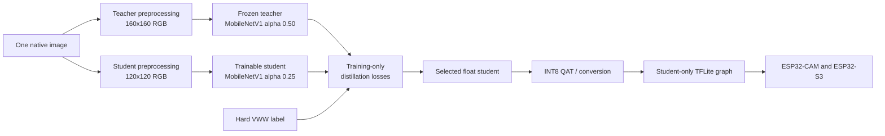

# Knowledge distillation for Visual Wake Words on ESP32

## Purpose

This document defines the research and experiment plan for transferring the accuracy of the
160x160 Visual Wake Words teacher into a model that can execute efficiently on ESP32-CAM and
ESP32-S3. It is the contract for the notebooks that will be added to this directory.

Knowledge distillation is a **training method**, not an ESP32 operator. Teacher heads, feature
adapters, attention losses, and relational losses must not appear in the exported student graph.
Consequently, distillation can improve a fixed student's accuracy but cannot reduce its device
latency, tensor arena, or model size by itself. Those costs are determined by the selected student
architecture, input contract, and integer representation.



## Frozen experimental context

The first distillation series uses the following roles. A new teacher may replace the primary
teacher only after passing the same frozen validation and test protocol.

| Role | Model | Input | Parameters | Estimated MACs | Purpose |
|---|---|---:|---:|---:|---|
| Primary teacher | MobileNetV1 alpha 0.50 | 160x160x3 | 830,049 | 76,013,312 | Training supervision only |
| First student | MobileNetV1 alpha 0.25 | 120x120x3 | about 218,801 | about 10.49M | Accuracy/efficiency starting point |
| Device reference | Fast-80 MobileNetV1-style | 80x80x3 | 111,793 | 3,993,536 | Existing physical-device reference |

The primary teacher is the original 12,000-image 160x160 experiment. Its recorded test F1 is
0.8464, PR-AUC is 0.9305, validation-selected threshold is 0.365, and it passed the repository's
distillation acceptance gate. The targeted 36,000-image teacher is not promoted automatically:
its global test F1 was 0.8351 and PR-AUC was 0.9301, although its error slices may still justify a
future specialist or multi-teacher experiment.

These numbers describe the current repository artifacts, not claims from the cited papers. All
student comparisons must use the same frozen image IDs, labels, split membership, and metric
implementation.

## What must remain controlled

Every distillation experiment must have a hard-label student control with the **same**:

- architecture, initialization, optimizer, learning-rate schedule, augmentation, batch size,
  training budget, and early-stopping rule;
- teacher-independent student preprocessing;
- validation-selected decision threshold;
- test set, which is evaluated only after model and threshold selection;
- export and physical-device profiling procedure.

If any of these changes, the result is not an isolated measurement of distillation.

## Technique taxonomy

A distillation method should be described as a combination of independent decisions:

```text
distillation experiment =
    knowledge source
  + transfer target
  + matching loss
  + teacher/student input contract
  + loss schedule
  + student architecture
  + quantization stage
```

The principal families are:

1. response-based distillation: match final logits or probabilities;
2. feature-based distillation: match internal representations or spatial attention;
3. relation-based distillation: match relationships between examples or features;
4. self-distillation: use the same network, an earlier generation, or internal branches as teacher;
5. quantization-aware distillation: combine teacher guidance with simulated low precision;
6. architecture-aware distillation: use teacher feedback while choosing the student topology.

Gou et al.'s [Knowledge Distillation: A Survey](https://arxiv.org/abs/2006.05525) provides a broad
taxonomy. The sections below define which parts are appropriate for this project.

## 1. Response-based knowledge distillation

### Foundation

[Distilling the Knowledge in a Neural Network](https://arxiv.org/abs/1503.02531) trains a student
against both hard labels and softened teacher outputs. For binary VWW, let teacher and student
logits be `z_t` and `z_s`:

$$
q_t = \sigma(z_t/T), \qquad q_s = \sigma(z_s/T)
$$

$$
L = (1-\lambda)L_{hard}(y,z_s)
    + \lambda T^2 L_{soft}(q_t,q_s)
$$

`T` is the temperature and `lambda` is the teacher-loss weight. Binary cross-entropy between
`q_t` and `q_s` is sufficient; it differs from the corresponding Bernoulli KL divergence only by
a teacher-entropy constant with respect to the student. The `T^2` factor compensates for the
temperature-induced gradient scaling.

### VWW-specific limitation

ImageNet logits express similarities among many classes. Binary VWW exposes only one independent
probability, so it contains much less class-relationship information. Temperature still conveys
teacher confidence and example difficulty, but response KD should not be assumed to produce a
large gain. This is why hard labels remain mandatory and feature transfer is a high-priority
follow-up.

### MCU evidence

[MicroNets](https://proceedings.mlsys.org/paper_files/paper/2021/file/c4d41d9619462c534b7b61d1f772385e-Paper.pdf)
is the closest published blueprint for this project. It studies MCU-constrained VWW and combines
differentiable architecture search, quantization-aware training, and teacher supervision. Its VWW
recipe uses a MobileNetV2 teacher with distillation coefficient 0.5 and temperature 4. MicroNets
targets commodity Arm microcontrollers and its results depend on that software/hardware stack, so
we adopt its KD configuration as a registered starting point rather than importing its latency
claims to ESP32.

### Planned experiment

The first technique notebook will compare:

| Run | Temperature | KD weight | Purpose |
|---|---:|---:|---|
| Hard control | n/a | 0.00 | Isolate the value of KD |
| Low-temperature KD | 1 | 0.50 | Confidence matching without softening |
| Moderate KD | 2 | 0.50 | Intermediate binary softening |
| MicroNets anchor | 4 | 0.50 | Paper-derived starting point |
| Weight ablations | best of 1/2/4 | 0.25, 0.75 | Test under/over-reliance on teacher |

Teacher logits should be cached by immutable image ID. Cache metadata must include teacher model
hash, manifest hash, preprocessing version, and output type. Do not cache post-threshold labels:
the continuous logit is the useful signal.

## 2. Attention transfer

[Paying More Attention to Attention](https://arxiv.org/abs/1612.03928) converts an activation
tensor into a channel-reduced spatial map. A common form is:

$$
A(F) = \operatorname{normalize}\left(\sum_c |F_c|^2\right)
$$

The student minimizes the distance between its attention map and the resized teacher attention
map. This is especially attractive here because the teacher and student have different channel
widths and spatial dimensions: channel reduction removes the width mismatch, and a documented
resize resolves the spatial mismatch.

### Planned experiment

- start with one late feature stage, then ablate early, middle, and late stages;
- resize the teacher attention map to the student map using one fixed interpolation rule;
- normalize each sample before matching so feature magnitude does not dominate;
- combine hard-label, response-KD, and attention losses;
- record attention-map examples for true positive, true negative, false positive, false negative,
  and small-person cases;
- discard all attention branches at export and verify graph equivalence to the hard-control
  student.

Attention transfer is the second priority because it transfers **where** the teacher looks, which
is relevant to small-person and clutter failures, without requiring equal channel counts.

## 3. FitNets and feature hints

[FitNets: Hints for Thin Deep Nets](https://arxiv.org/abs/1412.6550) aligns intermediate teacher
and student representations. When channel counts differ, a train-only 1x1 projection maps the
student feature tensor into the teacher's feature space:

$$
L_{hint}=\left\|F_t-\operatorname{Proj}(F_s)\right\|_2^2
$$

### Planned experiment

- map stages by effective output stride and receptive-field role, not merely by layer index;
- start with one late-middle hint and add a second hint only through an ablation;
- compare raw MSE with normalized feature MSE;
- keep projection parameters out of the deployable student;
- verify that the exported TFLite operator list, parameters, MACs, and activation shapes match the
  corresponding hard-control student.

FitNets is lower priority than attention transfer because it introduces channel adapters and more
layer-pairing choices.

## 4. Relation-based distillation

Relation-based methods transfer geometry between samples instead of directly matching each
sample's tensor.

- [Relational Knowledge Distillation](https://arxiv.org/abs/1904.05068) matches pairwise distances
  and angles.
- [Similarity-Preserving Knowledge Distillation](https://arxiv.org/abs/1907.09682) preserves
  pairwise activation similarities.
- [Contrastive Representation Distillation](https://arxiv.org/abs/1910.10699) formulates transfer
  as a contrastive representation objective.

These techniques do not change the deployed graph, but pairwise batch matrices, negative samples,
or memory banks can increase host training memory and experimental complexity. They are research
extensions, not first-line experiments. A relation method is promoted only if response plus
attention KD saturates while a reproducible student/teacher representation gap remains.

## 5. Quantization-aware knowledge distillation

[Apprentice](https://arxiv.org/abs/1711.05852) demonstrates that teacher supervision can help
recover accuracy in low-precision networks. [QKD: Quantization-aware Knowledge Distillation](https://arxiv.org/abs/1911.12491)
argues that naive simultaneous quantization and KD can be difficult because the quantized student
has reduced capacity while distillation acts as an additional constraint. QKD separates learning
into student adaptation, joint teacher/student learning, and tutoring phases.

Our target is conventional full INT8 rather than the more aggressive 4-bit setting studied in
QKD. The default sequence is therefore:


Only if ordinary QAT causes a material quality loss do we compare:

1. float KD followed by hard-label-only QAT;
2. float KD followed by continued response KD during QAT;
3. a QKD-inspired staged procedure;
4. hard-label QAT without KD as the quantized control.

The teacher does not need to be quantized merely because the student will run on an MCU. A float
teacher normally provides the cleanest training target; only the exported student must satisfy
the device contract.

## 6. Self-distillation and multi-teacher distillation

Self-distillation is useful when no stronger external teacher is available or when intermediate
branches provide useful regularization. It is not the first choice here because an accepted
160x160 teacher already exists.

Multi-teacher distillation may later combine the globally stronger 12,000-image teacher with a
specialist that improves a measured slice such as small-person recall. Teachers must not be
averaged blindly. The experiment needs a pre-registered gating or weighting rule and must compare
against each individual teacher on the same split.

## 7. Architecture-aware distillation

[MCUNet](https://arxiv.org/abs/2007.10319) co-designs TinyNAS and TinyEngine for MCU deployment. It
is essential architecture-search context but is not itself our primary distillation technique.
Likewise, MicroNets uses constrained architecture search alongside KD. Their key lesson is that
the student topology should be selected against measured resource constraints, not that their
reported architectures or latency automatically transfer to ESP32.

For a later search phase, a candidate score can combine validation quality and device constraints:

$$
S = Q_{KD} - \alpha \max(0,L/L_{max}-1)
           - \beta  \max(0,M/M_{max}-1)
           - \gamma \max(0,F/F_{max}-1)
$$

where `Q_KD` is a short KD-trained validation score, `L` is measured or accurately predicted
latency, `M` is peak runtime memory, and `F` is model storage. Search candidates must use operators
supported efficiently by [ESP-NN](https://github.com/espressif/esp-nn) and TensorFlow Lite Micro.
Final ranking still requires physical measurements on both ESP32-CAM and ESP32-S3.

## Input-resolution and preprocessing contract

The teacher and student should consume the same native source image through separate deterministic
branches:

```text
native JPEG / decoded RGB
    +-- teacher branch: resize/letterbox to 160x160 -> teacher normalization
    +-- student branch: resize/letterbox to 120x120 -> student/device normalization
```

Do not resize the already resized teacher tensor into the student tensor. That would add a second
resampling operation that is absent on the device. Training augmentation is sampled once at the
semantic level when practical, then applied consistently before the branch-specific resize.

The student branch must reproduce the firmware's channel order, crop or letterbox behavior,
normalization, integer range, and camera corrections. Distillation cannot compensate reliably for
a training/device preprocessing mismatch.

## Teacher use and calibration

- freeze the teacher and run it in inference mode;
- use logits, not thresholded decisions;
- never select temperature or loss weights on the test set;
- preserve hard labels because the teacher is imperfect;
- track teacher/student disagreement by label and person-size slice;
- inspect calibration because a strongly overconfident teacher can create poor soft targets;
- use the original 160x160 teacher as the first source because it passed the repository gate;
- treat the targeted-36k teacher as an unapproved specialist until a specific slice experiment is
  pre-registered.

## Evaluation contract

### Predictive quality

Every notebook must report:

- validation-selected threshold;
- accuracy, precision, recall, specificity, F1, ROC-AUC, and PR-AUC;
- confusion matrix and person/no-person prediction rate;
- expected calibration error and reliability diagram;
- small-, medium-, and large-person recall where annotations permit;
- teacher/student disagreement and confidence distributions;
- at least one bootstrap confidence interval or repeated-seed summary for promoted candidates.

### Static deployment resources

- physical and trainable parameters;
- TFLite flatbuffer bytes and compressed bytes, clearly distinguished;
- estimated MACs and operator inventory;
- live activation estimate and the layer that creates the peak;
- quantization input/output scales, zero points, and integer types;
- proof that training-only KD components are absent from the exported graph.

### Physical ESP32 measurements

- batch-one `Invoke()` latency distribution, not only its mean;
- preprocessing, capture, inference, postprocessing, and full-loop latency;
- sustained inference FPS and camera-stream FPS;
- actual tensor-arena use and allocation headroom;
- internal SRAM, PSRAM, and flash use from the build and runtime probe;
- per-operator latency when the profiling build supports it;
- ESP32-CAM and ESP32-S3 results reported separately;
- flash LED disabled during profiling unless the experiment explicitly studies illumination.

An accuracy increase is not an efficiency increase. Since two KD runs with the same student graph
should have the same device cost, any apparent latency difference must be treated as measurement
noise until the graphs and repeated device timings are checked.

## Acceptance gates

A distillation candidate is promoted only if all relevant gates pass:

1. it improves the hard-label student's validation PR-AUC or F1 beyond the declared tolerance;
2. it does not obtain the gain through an unacceptable specificity or recall collapse;
3. the improvement remains on the untouched test set and important error slices;
4. the exported graph contains only the intended student;
5. full INT8 conversion succeeds without float fallback;
6. desktop TFLite predictions agree with the quantized reference within a recorded tolerance;
7. the model fits the measured device memory budget with safety headroom;
8. physical latency and end-to-end FPS satisfy the target for that board.

## Notebook roadmap

The numbering should continue independently inside this folder so that distillation remains a
coherent phase:

| Notebook | Technique | Main question |
|---|---|---|
| [`01_distillation_reference_and_student_control_evaluated.ipynb`](hard-label%20control/01_distillation_reference_and_student_control_evaluated.ipynb) ([result report](hard-label%20control/01_DISTILLATION_REFERENCE_RESULTS.md)) | Audit + hard control | Is the teacher/student/data/device contract valid? |
| [`02_response_kd_hinton_micronets.ipynb`](response-based%20distillation/02_response_kd_hinton_micronets.ipynb) | Hinton/MicroNets response KD | Does binary soft supervision improve the fixed student? |
| `03_attention_transfer.ipynb` | Spatial attention KD | Does localization transfer improve difficult person slices? |
| `04_fitnets_feature_hints.ipynb` | Feature regression | Do direct representation hints outperform attention maps? |
| `05_quantization_aware_distillation.ipynb` | KD + INT8 QAT | Which staging preserves float-student quality? |
| `06_relation_based_distillation.ipynb` | RKD/SPKD | Is added training complexity justified? |
| `07_hardware_aware_student_search.ipynb` | KD-guided search | Which ESP-NN-friendly topology gives the best device Pareto point? |
| `08_distillation_device_report.ipynb` | Final deployment audit | What changed on ESP32-CAM and ESP32-S3? |

Notebook 01 must run before any technique notebook. Notebook 02 must establish the response-KD
baseline before feature losses are introduced. Notebook 05 starts only after a float student is
selected; otherwise quantization and distillation effects become confounded.

## Required figures

Each technique notebook should create only figures that answer an experimental question:

1. hard-label control versus KD metric dashboard;
2. PR and ROC curves using identical test IDs;
3. calibration/reliability comparison;
4. teacher-student probability scatter and disagreement quadrants;
5. error-slice recall, especially person size and image brightness;
6. loss-component curves for hard, soft, and feature losses;
7. accuracy versus MACs, flatbuffer bytes, tensor arena, and measured latency;
8. paired attention maps for the Attention Transfer notebook;
9. float-to-INT8 quality delta for the QAT notebook;
10. a final Pareto chart separating measured hardware results from graph estimates.

Every chart must label whether a resource value is estimated, desktop-measured, or
physical-device-measured.

## Artifact layout

Each notebook should write reproducible outputs under a dedicated artifact directory rather than
inside `optimization/distillation`:

```text
artifacts/distillation/<experiment>/
    checkpoints/
    figures/
    models/
    reports/
        config_snapshot.yaml
        environment.json
        metrics.json
        static_profile.json
        device_profile.json
        experiment_summary.json
```

Large checkpoints, cached features, generated figures, and device logs should remain ignored by
Git. Notebooks, compact JSON/CSV summaries, configuration files, and final Markdown reports may be
tracked when they are required to reproduce or audit a result.

## Risks and failure interpretations

| Observation | Likely interpretation | Next check |
|---|---|---|
| KD equals hard control | Binary logits carry little additional information | Try attention transfer; inspect confidence diversity |
| KD is worse | Teacher errors, excessive lambda, temperature, or preprocessing mismatch | Disagreement slices and cache hashes |
| Float KD improves but INT8 loses it | Quantization range/observer problem | QAT staging and activation distributions |
| Desktop improves but camera fails | Domain or preprocessing mismatch | Capture real-device frames and compare tensors |
| Accuracy improves but FPS does not | Expected for identical student graph | Confirm graph identity and timing variance |
| Feature KD is unstable | Poor layer pairing or loss-scale imbalance | Normalize features and start from one late hint |
| Small-person recall remains poor | Student resolution/receptive field is limiting | Attention maps, 128/144 input ablation, or architecture search |

## Recommended immediate sequence

1. Build Notebook 01 to verify artifacts, cache identity, preprocessing parity, student resource
   estimates, and the hard-label 120x120 control.
2. Build Notebook 02 with the paper-derived `T=4`, `lambda=0.5` anchor plus the small registered
   sweep in this document.
3. Promote one response-KD configuration using validation results only.
4. Add Attention Transfer before FitNets because it naturally tolerates different channel widths.
5. Select the best float student and then perform INT8 QAT.
6. Deploy the integer student and measure both physical boards before beginning architecture search.

This order answers the cheapest and most important question first: whether the accepted teacher
can improve a fixed, deployable student without changing its inference cost.

## Primary references

1. Hinton, Vinyals, and Dean, [Distilling the Knowledge in a Neural Network](https://arxiv.org/abs/1503.02531), 2015.
2. Romero et al., [FitNets: Hints for Thin Deep Nets](https://arxiv.org/abs/1412.6550), 2014.
3. Zagoruyko and Komodakis, [Paying More Attention to Attention](https://arxiv.org/abs/1612.03928), 2016.
4. Park et al., [Relational Knowledge Distillation](https://arxiv.org/abs/1904.05068), 2019.
5. Tung and Mori, [Similarity-Preserving Knowledge Distillation](https://arxiv.org/abs/1907.09682), 2019.
6. Tian, Krishnan, and Isola, [Contrastive Representation Distillation](https://arxiv.org/abs/1910.10699), 2019.
7. Mishra and Marr, [Apprentice: Using Knowledge Distillation Techniques to Improve Low-Precision Network Accuracy](https://arxiv.org/abs/1711.05852), 2017.
8. Kim et al., [QKD: Quantization-aware Knowledge Distillation](https://arxiv.org/abs/1911.12491), 2019.
9. Banbury et al., [MicroNets](https://proceedings.mlsys.org/paper_files/paper/2021/file/c4d41d9619462c534b7b61d1f772385e-Paper.pdf), MLSys 2021.
10. Lin et al., [MCUNet](https://arxiv.org/abs/2007.10319), NeurIPS 2020.
11. Chowdhery et al., [Visual Wake Words Dataset](https://arxiv.org/abs/1906.05721), 2019.
