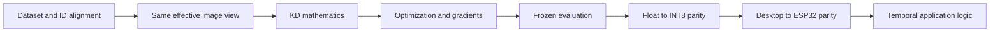
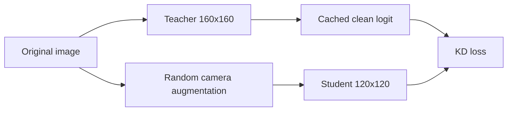
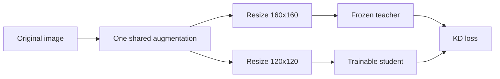
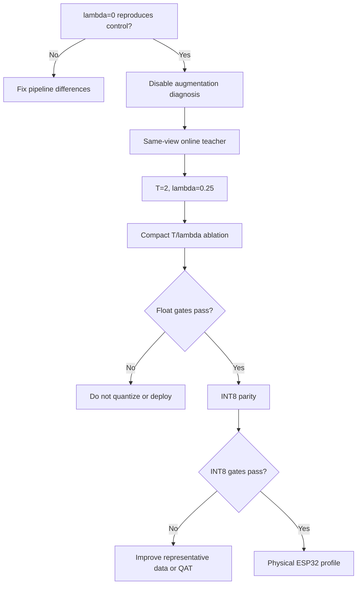

# Debugging knowledge distillation for VWW on ESP32

## Purpose

This document defines how to diagnose incorrect, unstable, or disappointing knowledge-distillation
(KD) results in this repository. It covers the complete path from dataset joins and loss
mathematics through INT8 export and physical ESP32 inference.

The principal rule is:

> A final accuracy regression is a symptom, not a diagnosis. Validate the data, objective,
> optimization, evaluation, export, and device contracts independently.

The guide is written for the current Visual Wake Words (VWW) experiment:

| Role | Model | Input | Output |
|---|---|---:|---|
| Teacher | MobileNetV1 alpha 0.50 | 160x160x3 RGB | One person logit |
| Student | MobileNetV1 alpha 0.25 | 120x120x3 RGB | One person logit |
| Target runtime | ESP32-CAM / ESP32-S3 | Batch one | Integer-only TFLite Micro |

It also provides a reusable contract for later response-, feature-, attention-, relation-, and
quantization-aware distillation notebooks.

## 1. Failure categories

KD failures usually belong to one of six categories.

| Category | Typical symptom | Examples |
|---|---|---|
| Data contract | Loss trains, but quality is nonsensical | Shifted teacher rows, wrong image ID, inverted labels |
| View contract | KD degrades while hard labels work | Teacher saw a clean image but student saw a strong augmentation |
| Objective | Unstable or ineffective soft loss | Probabilities divided by `T`, missing `T^2`, accidental broadcasting |
| Optimization | No convergence or teacher domination | Frozen head, bad learning rate, conflicting gradients |
| Evaluation | Apparently good offline result fails live | Test-tuned threshold, class mapping error, temporal hold logic |
| Deployment | Python works but ESP32 does not | RGB/BGR mismatch, wrong quantization parameters, crop mismatch |

Debug in that order. A later-stage metric cannot prove that an earlier contract is correct.



## 2. Establish a causal hard-label control

The strongest pipeline test is to run the KD notebook with the teacher contribution disabled:

```python
teacher_weight = 0.0
```

For response KD,

$$
L = (1-\lambda)L_{hard} + \lambda T^2L_{soft},
$$

setting `lambda=0` must reduce the training procedure to the hard-label control. This run should
reproduce Notebook 01 within ordinary seed variation.

The following properties must be identical between the control and KD experiment:

- dataset manifest and train/validation/test image IDs;
- model architecture and initial weights;
- preprocessing and augmentation;
- trainable/frozen layers and BatchNorm policy;
- optimizer, schedule, batch size, epoch budget, and checkpoint monitor;
- validation threshold-selection method;
- test metric implementation;
- TFLite conversion and representative dataset.

Recommended equivalence tolerances for this project are:

| Metric | Suggested maximum difference |
|---|---:|
| Test PR-AUC | 0.003 |
| Test F1 | 0.005 |
| Parameter count | Exactly zero |
| MAC count | Exactly zero |
| Operator set | Exactly equal |

If the `lambda=0` run does not reproduce the control, stop. The observed difference cannot yet be
attributed to knowledge distillation.

## 3. Validate dataset and teacher-target alignment

### 3.1 Join by immutable identity

Teacher outputs must be joined by immutable `image_id`, never by row position after filtering or
shuffling. Each row should contain at least:

```text
image_id, image_path, split, label, teacher_logit, teacher_model_hash
```

Minimum assertions:

```python
required = {"image_id", "image_path", "split", "label", "teacher_logit"}
assert required.issubset(kd_frame.columns)
assert kd_frame["image_id"].is_unique
assert kd_frame["teacher_logit"].notna().all()
assert np.isfinite(kd_frame["teacher_logit"]).all()
assert set(kd_frame["label"].unique()).issubset({0, 1})
assert set(kd_frame["split"].unique()) == {"train", "val", "test"}
```

After merging separate tables, verify that labels and splits did not change:

```python
merged = manifest.merge(
    teacher_targets,
    on="image_id",
    how="left",
    validate="one_to_one",
    suffixes=("_manifest", "_teacher"),
)

assert (merged.label_manifest == merged.label_teacher).all()
assert (merged.split_manifest == merged.split_teacher).all()
```

Record hashes for the manifest, teacher model, teacher-target cache, experiment configuration, and
student initialization. This distinguishes a real reproduction from an experiment that silently
used different inputs.

### 3.2 Inspect teacher targets semantically

Randomly inspect examples from all four groups:

| Ground truth | Teacher decision | Why inspect it |
|---|---|---|
| Person | Correct | Normal positive supervision |
| No person | Correct | Normal negative supervision |
| Person | Incorrect | Teacher error that hard labels must override |
| No person | Incorrect | Potential source of false-positive transfer |

Also stratify by person size, brightness, occlusion, and ESP32 camera domain. A globally strong
teacher may still be systematically wrong on the deployment distribution.

## 4. Enforce the teacher/student view contract

The hard label usually survives moderate augmentation; a continuous teacher probability may not.
A teacher probability computed on a clean, centered image is not necessarily the correct target
for a darkened and translated version of that image.

### Incorrect offline-target flow



### Correct same-view flow



Reference implementation:

```python
source = decode_image(path)
shared_view = augment(source, training=True)

teacher_image = resize_and_normalize(shared_view, (160, 160))
student_image = resize_and_normalize(shared_view, (120, 120))

teacher_logits = teacher(teacher_image, training=False)
student_logits = student(student_image, training=True)
```

The teacher must be frozen and called with `training=False`. This prevents BatchNorm statistics or
dropout from changing the target.

### Low-cost diagnosis

Before implementing online teacher inference, run one experiment with random augmentation
disabled. If the KD result improves materially, cached-clean-target/view mismatch is a strong
candidate cause. This experiment diagnoses the problem but is not necessarily the final recipe.

If cached logits must be retained, restrict augmentation to transformations known not to alter
teacher confidence materially, or precompute deterministic augmented views and their corresponding
teacher logits.

## 5. Audit binary response-KD mathematics

For binary VWW, let `z_t` and `z_s` be teacher and student logits:

$$
q_t=\sigma(z_t/T), \qquad q_s=\sigma(z_s/T).
$$

The combined objective is:

$$
L=(1-\lambda)\operatorname{BCE}(y,z_s)
  +\lambda T^2D_{KL}(\operatorname{Bern}(q_t)\|\operatorname{Bern}(q_s))
  +L_{reg}.
$$

Binary cross-entropy with `q_t` as the target differs from Bernoulli KL only by teacher entropy,
which is constant with respect to the student. Subtracting teacher entropy makes the diagnostic
soft loss approach zero when teacher and student logits match.

### Implementation rules

1. Apply temperature to logits, not probabilities.
2. Use logits-aware cross-entropy for numerical stability.
3. Multiply the soft term by `T^2` when following the Hinton formulation.
4. Use `T=1` for exported inference.
5. Reshape every binary tensor explicitly to `[batch, 1]`.
6. Keep hard labels in the objective because the teacher is not perfect.

Correct:

```python
teacher_soft = tf.sigmoid(teacher_logits / temperature)
soft_ce = tf.reduce_mean(
    tf.nn.sigmoid_cross_entropy_with_logits(
        labels=teacher_soft,
        logits=student_logits / temperature,
    )
)
```

Incorrect:

```python
# Temperature does not operate on an already-squashed probability.
teacher_soft = teacher_probability / temperature
```

### Shape safety

An unnoticed `[B]` versus `[B, 1]` operation can broadcast into a `[B, B]` loss matrix:

```python
labels = tf.reshape(tf.cast(labels, tf.float32), (-1, 1))
teacher_logits = tf.reshape(tf.cast(teacher_logits, tf.float32), (-1, 1))
student_logits = tf.reshape(tf.cast(student_logits, tf.float32), (-1, 1))

tf.debugging.assert_equal(tf.shape(labels), tf.shape(student_logits))
tf.debugging.assert_equal(tf.shape(teacher_logits), tf.shape(student_logits))
```

## 6. Required objective unit tests

Run these tests before full training.

### 6.1 Equal logits imply near-zero KL

```python
teacher = tf.constant([[-2.0], [0.0], [3.0]])
student = tf.identity(teacher)
loss = binary_kd_kl(teacher, student, temperature=4.0)
assert float(loss) < 1e-6
```

### 6.2 An opposite student is worse

```python
matching = binary_kd_kl(teacher, teacher, temperature=4.0)
opposite = binary_kd_kl(teacher, -teacher, temperature=4.0)
assert float(opposite) > float(matching)
```

### 6.3 `lambda=0` equals hard loss

```python
total = combined_kd_loss(
    labels, teacher_logits, student_logits,
    temperature=4.0, teacher_weight=0.0,
)
hard = hard_label_loss(labels, student_logits)
np.testing.assert_allclose(total, hard, rtol=1e-5, atol=1e-7)
```

### 6.4 Loss and gradients are finite

```python
with tf.GradientTape() as tape:
    logits = student(images, training=True)
    loss = combined_kd_loss(labels, teacher_logits, logits, T, alpha)

gradients = tape.gradient(loss, student.trainable_variables)
finite_gradients = [g for g in gradients if g is not None]

tf.debugging.assert_all_finite(loss, "KD loss is non-finite")
for gradient in finite_gradients:
    tf.debugging.assert_all_finite(gradient, "KD gradient is non-finite")
assert finite_gradients
```

## 7. Use a single-batch overfit test

Before spending hours on the complete dataset, repeatedly train on 32-64 examples:

```python
debug_images, debug_targets = next(iter(train_kd_ds.take(1)))

for step in range(500):
    metrics = distiller.train_step((debug_images, debug_targets))
```

Expected behavior:

- total, hard, and soft loss decrease;
- student predictions move toward both valid labels and teacher targets;
- gradient norm remains finite and nonzero;
- the small batch can be fit to high accuracy;
- teacher weights and BatchNorm statistics remain unchanged.

Failure to fit one batch indicates a pipeline or optimization defect, not inadequate model
capacity on the full task.

## 8. Measure hard/soft gradient conflict

The scalar loss can look normal even when hard and soft supervision pull the student in opposite
directions. Measure their gradients separately:

```python
with tf.GradientTape() as hard_tape:
    logits = student(images, training=True)
    hard_loss = hard_label_loss(labels, logits)
hard_gradients = hard_tape.gradient(hard_loss, student.trainable_variables)

with tf.GradientTape() as soft_tape:
    logits = student(images, training=True)
    soft_loss = binary_kd_kl(teacher_logits, logits, temperature)
soft_gradients = soft_tape.gradient(soft_loss, student.trainable_variables)
```

Log the hard gradient norm, unweighted and weighted soft norms, and their cosine similarity:

$$
\cos(g_h,g_s)=\frac{g_h\cdot g_s}{\|g_h\|\|g_s\|}.
$$

| Observation | Interpretation | Candidate action |
|---|---|---|
| Cosine near +1 | Objectives agree | Continue |
| Cosine near 0 | Teacher adds weak/unrelated signal | Inspect teacher and transfer target |
| Cosine below 0 | Teacher conflicts with labels | Reduce `lambda`; inspect teacher errors |
| Soft norm dominates | KD overwhelms task loss | Reduce `lambda` or revise temperature |
| Soft norm near zero | KD has no optimization effect | Inspect logits, temperature, and frozen graph |

Report these statistics globally and separately for teacher-correct and teacher-wrong samples.

## 9. Diagnose temperature and teacher weight

Temperature controls target softness; `lambda` controls how strongly those targets affect the
student. They must be tuned independently. Report the softened probability distribution, entropy,
weighted loss and gradient magnitudes, validation quality, specificity, and predicted-positive
rate for each run.

The registered response-KD sweep is:

| Run | Temperature | Teacher weight | Purpose |
|---|---:|---:|---|
| Control | 1 | 0.00 | Pipeline-equivalence test |
| KD-A | 1 | 0.25 | Confidence matching without softening |
| KD-B | 2 | 0.25 | Moderate binary KD; next priority |
| KD-C | 2 | 0.50 | Test stronger moderate-temperature KD |
| KD-D | 4 | 0.25 | Separate temperature from teacher weight |
| Existing anchor | 4 | 0.50 | Hinton/MicroNets-derived starting point |

Do not perform a large blind sweep. Correct the view contract first, then run the compact matrix
from the same initialization and data order.

## 10. Debug checkpoint and training behavior

For every epoch, preserve hard loss, soft loss before weighting, weighted components,
regularization, total loss, gradient norms, train/validation PR-AUC, and learning rate.

Checklist:

- checkpoint selection monitors validation PR-AUC, not training loss;
- test data never controls early stopping or threshold selection;
- the best checkpoint is reloaded before export;
- Stage B begins from the best Stage A checkpoint;
- intended backbone layers are trainable;
- BatchNorm remains frozen during limited-data fine-tuning;
- teacher variables never appear in the optimizer variable list;
- a notebook restart-and-run-all produces the same artifact hashes.

Lower training quality than validation quality is not automatically an error when strong
augmentation is active only during training.

## 11. Evaluate ranking and operating-point behavior separately

Threshold-independent metrics describe ranking quality: PR-AUC, ROC-AUC, and the complete
precision-recall curve. Threshold-dependent metrics describe deployed behavior: accuracy,
precision, recall, specificity, F1, false-positive count, predicted-positive rate, calibration,
and the selected threshold.

Select the threshold on validation data and freeze it before test evaluation. A model can preserve
PR-AUC while becoming biased toward `person`, producing unacceptable flash behavior.

For this application, acceptance must include false-positive behavior:

```python
accepted = all([
    kd_pr_auc >= control_pr_auc,
    kd_f1 >= control_f1 - 0.005,
    kd_specificity >= control_specificity - 0.01,
    kd_predicted_positive_rate <= maximum_positive_rate,
])
```

Report paired bootstrap confidence intervals for KD-minus-control metric changes. A small point
estimate is not evidence of improvement when its confidence interval crosses zero.

## 12. Diagnose error slices

Compare teacher, hard control, and KD student on:

- small, medium, and large people;
- brightness quartiles;
- camera-domain versus COCO-domain samples;
- teacher-correct/control-wrong samples;
- teacher-wrong/control-correct samples;
- newly fixed and newly broken student decisions.

The paired decision table should contain:

```text
image_id, label, teacher_probability, control_probability, kd_probability,
teacher_correct, control_correct, kd_correct, person_size, brightness
```

A useful slice gain does not automatically justify global promotion. It may instead motivate a
specialist teacher, slice-weighted objective, or deployment threshold policy.

## 13. Separate KD quality from architecture efficiency

Distillation is a training method. If the student graph remains fixed, response KD should not
change parameters, MACs, activation shapes, tensor-arena requirement, operator set, or physical
latency beyond insignificant measurement noise.

Verify static graph identity before making hardware-efficiency claims. A material latency change
with a supposedly identical graph points to conversion, compiler, clock, or memory-placement
differences—not response KD itself.

## 14. Validate float-to-INT8 parity

Quantization is a separate source of error. For identical frozen images, store float and INT8
probabilities, their absolute differences, and both decisions.

Check that:

- representative images use exact inference preprocessing;
- representative data includes dark and camera-domain samples;
- input/output dtypes, scales, and zero points are honored;
- the graph is integer-only and contains no random augmentation operators;
- the INT8 threshold is selected on INT8 validation predictions;
- probability MAE and decision disagreement remain inside registered limits.

Current repository gates are:

| Gate | Limit |
|---|---:|
| Float-to-INT8 probability MAE | At most 0.03 |
| INT8 F1 loss | At most 0.03 absolute |
| Static graph identity | Required |

Do not attribute an INT8 regression to KD until the float model passes its control comparison.

## 15. Validate desktop-to-device parity

Feed one identical saved RGB image through the TensorFlow float model, desktop TFLite INT8
interpreter, and ESP32 preprocessing plus TFLite Micro. Log:

```text
source dimensions and pixel format
crop or letterbox coordinates
resized dimensions
RGB channel samples
input tensor minimum, maximum, and mean
input scale and zero point
raw output tensor
output scale and zero point
dequantized probability
frame decision
temporal state
```

Common deployment defects include RGB565 decoding errors, BGR/RGB reversal, crop/letterbox
mismatch, double normalization, signed `int8` interpreted as unsigned bytes, inverted output
mapping, use of training temperature at inference, and an old model header compiled into firmware.

Compare tensors before changing the model. A correct model cannot compensate reliably for a broken
device input contract.

## 16. Keep model inference and temporal logic separate

The web console and flash controller should expose three states:

```text
raw probability
thresholded frame decision
temporally filtered application decision
```

Example:

```python
frame_person = probability >= threshold
stable_person = positive_count_in_window >= required_positive_frames
flash_on = stable_person
```

A long hold time, hysteresis, or stale message can show `person` after the raw model changed to
`no person`. That is an application-state issue, not a KD error. Log frame ID and timestamp with
every probability and state transition.

## 17. Current Notebook 02 diagnosis

The completed `T=4`, `lambda=0.5` response-KD run trained and exported without NaNs or notebook
errors. Its checkpoint correctly monitored validation PR-AUC. The outcome is nevertheless not
accepted.

| Model | Accuracy | Precision | Recall | Specificity | F1 | PR-AUC |
|---|---:|---:|---:|---:|---:|---:|
| Student-120 hard control | 73.80% | 70.31% | 80.63% | 67.22% | 75.12% | 84.06% |
| Student-120 response KD | 71.60% | 66.83% | 83.59% | 60.06% | 74.28% | 83.98% |
| Response KD INT8 | 71.15% | 66.67% | 82.36% | 60.35% | 73.69% | 83.48% |

Response KD increased recall by 2.96 points but reduced specificity by 7.16 points. It changed the
test confusion counts from `334 FP / 190 FN` to `407 FP / 161 FN`. It fixed 63 control mistakes
and broke 107 control successes, a net loss of 44 correct predictions.

| Delta | Point estimate | 95% bootstrap interval |
|---|---:|---:|
| PR-AUC | -0.0008 | -0.0060 to +0.0048 |
| F1 | -0.0084 | -0.0195 to +0.0015 |

The run improved small-person recall from 52.59% to 63.79%, but the global false-positive cost is
unacceptable for flash activation.

### Concrete concerns

1. `RandomSaturation(0.45)` was interpreted by Keras as the range `(-0.45, +0.45)`, not the
   intended multiplicative range `(0.55, 1.45)`. Negative sampled factors clamp to zero and
   converted many training views to grayscale. Notebooks 01 and 02 therefore share this historical
   augmentation behavior; Notebook 03 retains it only in the legacy equivalence run and uses the
   corrected range for its same-view control and KD candidates.
2. Teacher logits were cached from clean images while random translation, brightness, contrast,
   saturation, and sensor noise were applied inside the student graph.
3. `T=4` reduced teacher probability standard deviation from 0.369 to 0.157 and eliminated extreme
   soft targets; this may be excessive for one-output binary KD.
4. The 0.5 teacher weight made the soft objective substantial despite limited information in a
   binary response.
5. INT8 probability MAE was 0.0356, above the 0.03 parity gate.
6. The notebook has no execution errors, but one visualization cell is unexecuted and some cells
   were rerun out of order. A clean restart-and-run-all is required before publication.

These observations do not prove that response KD is unsuitable. They show that this particular
input contract and hyperparameter anchor should not be promoted.

## 18. Required next experiment sequence

1. **Pipeline equivalence:** rerun Notebook 02 with `lambda=0` and compare with Notebook 01.
2. **View diagnosis:** run the existing KD configuration with random augmentation disabled.
3. **Contract correction:** perform online teacher inference from the same augmented source view.
4. **Moderate KD:** train `T=2`, `lambda=0.25` from the registered initialization.
5. **Compact ablation:** finish the temperature/weight matrix in Section 9.
6. **Gradient audit:** report hard/soft norms and cosine similarity.
7. **Float selection:** accept only after paired quality and false-positive gates pass.
8. **INT8 conversion:** quantify float/INT8 probability and decision parity.
9. **Physical profiling:** deploy the exact accepted FlatBuffer to ESP32-CAM and ESP32-S3.
10. **Application validation:** verify raw probability, temporal decision, and flash state separately.



## 19. Experiment acceptance checklist

### Data and reproducibility

- [ ] Manifest, teacher, targets, configuration, and initialization hashes recorded.
- [ ] All joins are one-to-one by immutable image ID.
- [ ] Teacher and student see the same effective image content.
- [ ] Teacher is frozen and evaluated with `training=False`.
- [ ] Restart-and-run-all completes without error.

### Objective and optimization

- [ ] `lambda=0` reproduces the hard-label control.
- [ ] Equal teacher/student logits produce near-zero KL.
- [ ] Loss shapes are `[batch, 1]`; no broadcasting occurs.
- [ ] Losses and gradients are finite.
- [ ] Single-batch overfit test passes.
- [ ] Hard/soft gradient norms and cosine similarity are reported.
- [ ] Best validation checkpoint is reloaded before evaluation.

### Evaluation

- [ ] Threshold is selected on validation data only.
- [ ] PR-AUC, F1, recall, specificity, and predicted-positive rate are reported.
- [ ] Confusion matrices and paired fixed/broken counts are reported.
- [ ] Person-size, brightness, and camera-domain slices are reported.
- [ ] Bootstrap confidence intervals accompany control deltas.

### Export and hardware

- [ ] Exported graph contains only the student inference graph.
- [ ] Parameters, MACs, activation shapes, and operator set match the control student.
- [ ] Float-to-INT8 probability parity passes.
- [ ] Desktop TFLite and ESP32 agree on identical saved frames.
- [ ] Tensor arena, latency, preprocessing time, and pipeline FPS are measured physically.
- [ ] Flash is disabled during workplace profiling unless explicitly requested.

## Decision rule

A KD experiment succeeds only when it provides a measured quality improvement or justified
task-specific trade-off on the frozen evaluation set **without** violating calibration,
false-positive, quantization-parity, or device-runtime constraints. Lower training loss alone is
not evidence of successful knowledge transfer.
